La Ciudad de México (CDMX) is my favorite city.

And probably the world's most _interesting_. One moment I'm having the most peaceful walk of my life through a quiet, leafy neighborhood. In the next, I'm in the most chaotic, crowded market. The food is ridiculously good at every level, whether it's $2 or $200. Sometimes it feels like I'm in Europe, sometimes I'm reminded of Southeast Asia, but I never feel too far from the USA either. Yet it is uniquely Mexican, especially when you layer in the prehispanic traditions.[^history] That mix is reflected everywhere: the food, the art, the people, and the city itself.

[^history]: Consider that the Aztec language gave us the words for tomato, chili, and chocolate. If you're interested, I recommend [this article series](https://unchartedterritories.tomaspueyo.com/p/mexico-before-europeans), which [culminates on Mexico City](https://unchartedterritories.tomaspueyo.com/p/why-is-mexico-city-the-way-it-is).

<!--  lines must not be indented so Astro knows to optimize the images in this normal .md file. -->

<figure class="gallery" aria-label="Scenes from Mexico City">

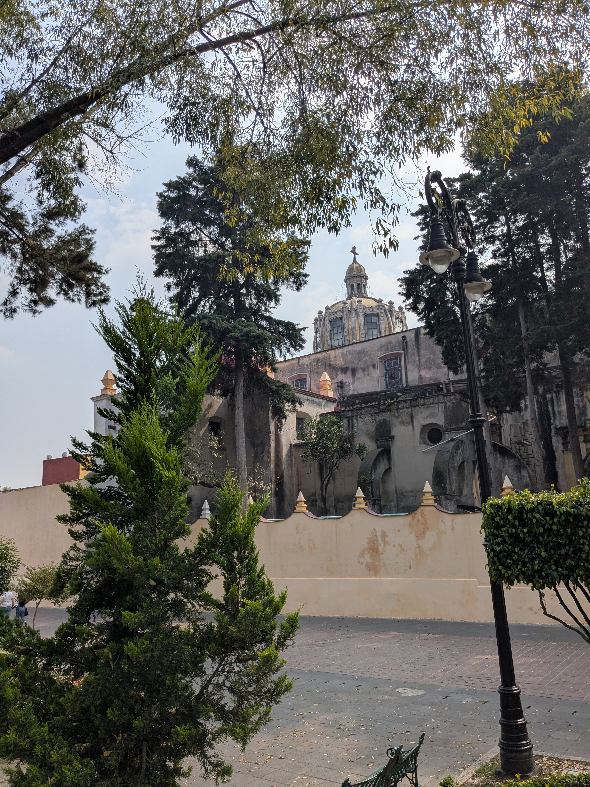
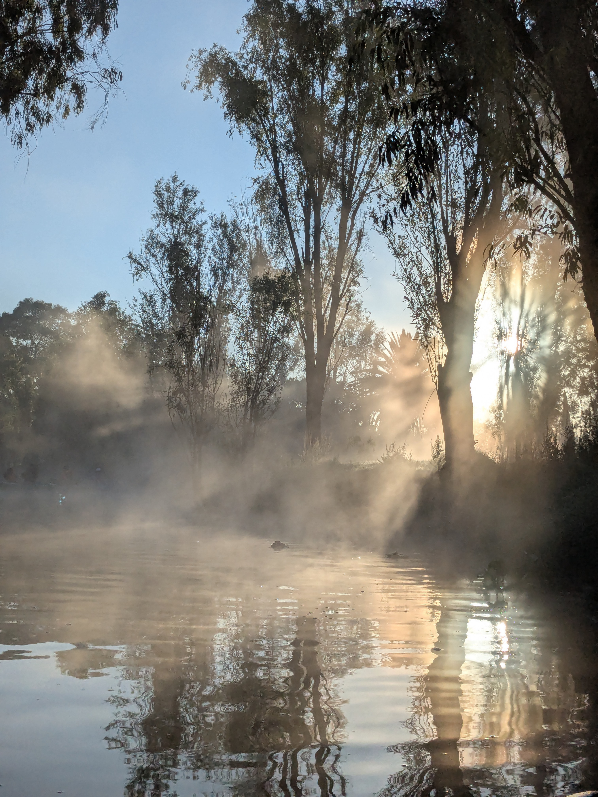
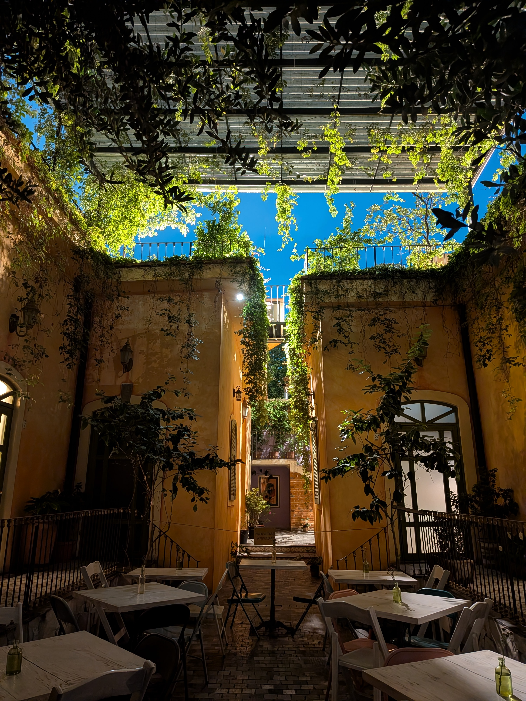
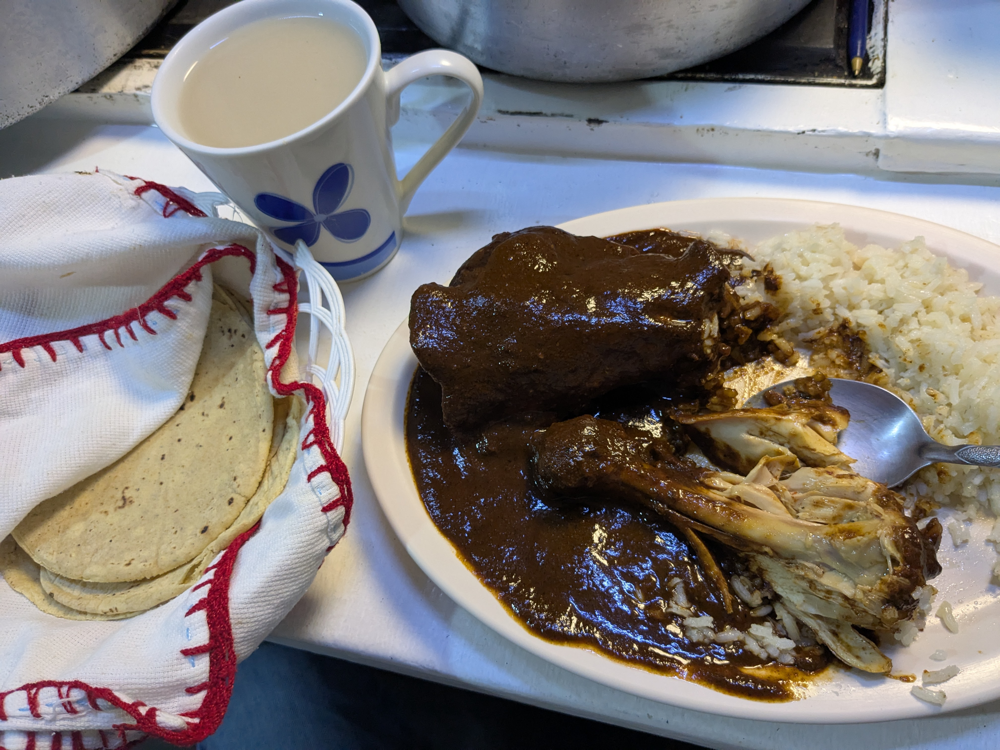

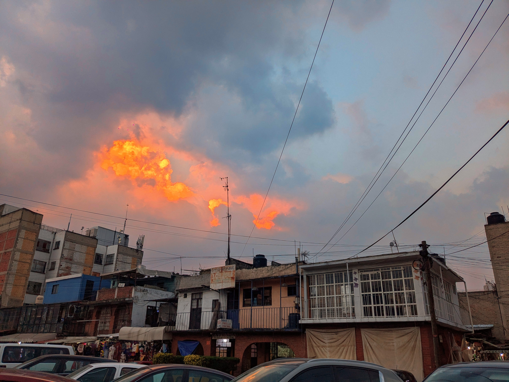
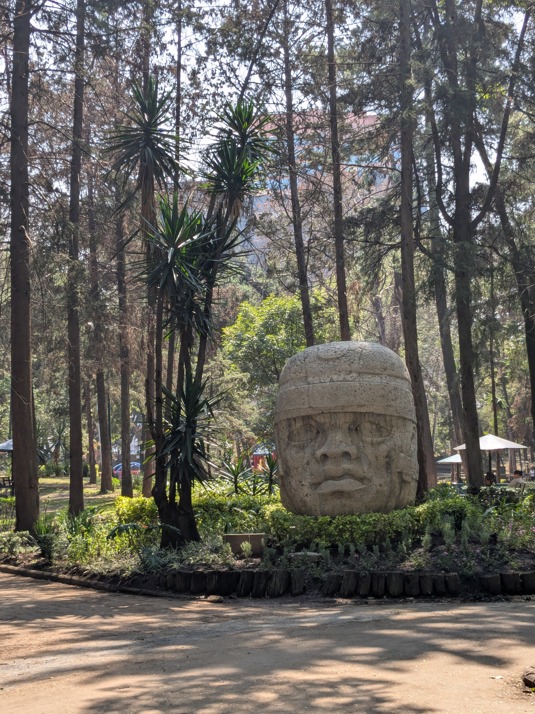
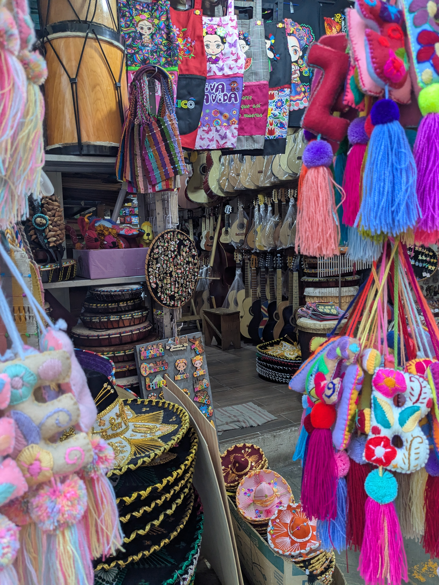
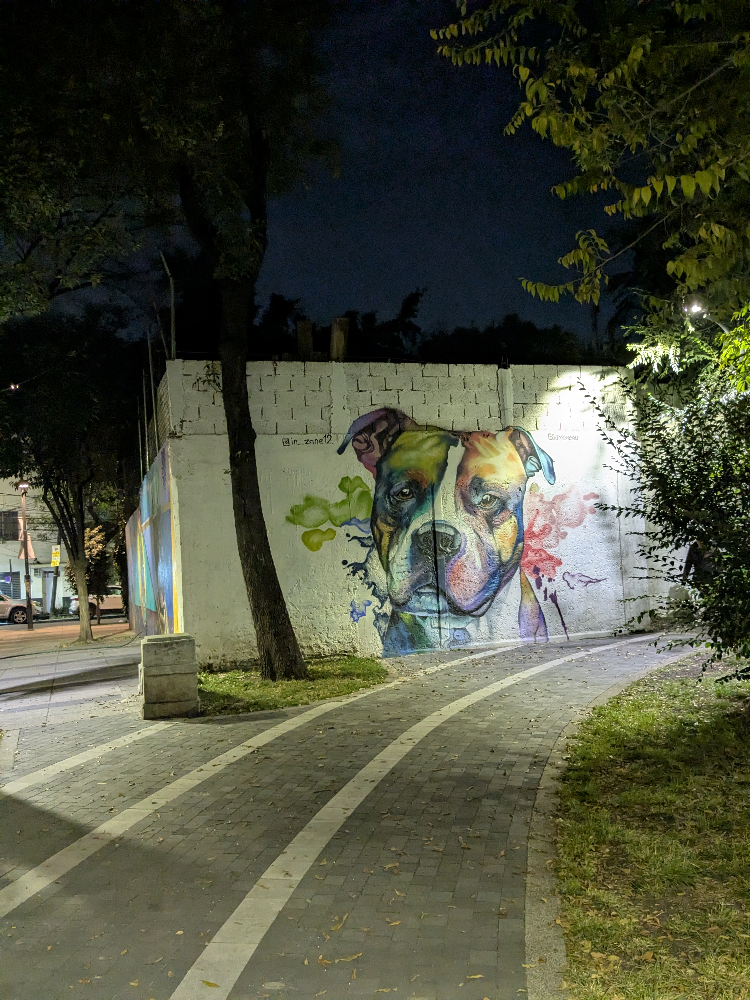

</figure>

I've visited five times in the past couple years, to explore new spots and return to old favorites.

## Where to stay

**Roma Norte** or **La Condesa**. Roma Norte is vibrant and central but it stays loud at night. La Condesa is more quaint and quiet.

If you speak some Spanish and have already visited a couple of times, consider Santa María la Ribera or going for cheaper stays farther south.

### Neighborhoods

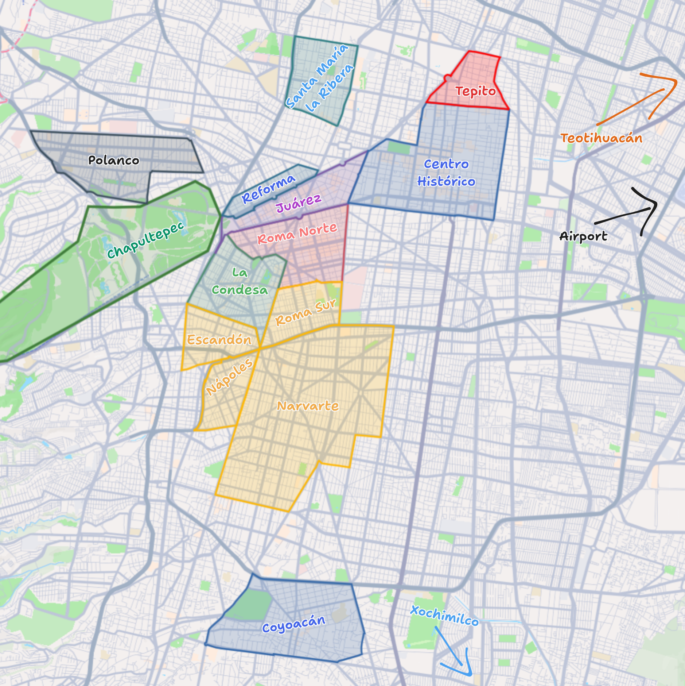 [^map-oversimplified]

[^map-oversimplified]: These boundaries are oversimplified. Especially Narvarte, sorry. And this is not comprehensive.

Quick overview, in order of visit priority:

1. [**Roma Norte**](#roma-norte) is the coolest all-around neighborhood packed with restaurants, bars, parks, street food, shops, and clubs.
2. [**Centro Histórico**](#centro-histórico) has grand colonial-era buildings, museums, and some upscale restaurants. It's almost always crowded.
3. [**La Condesa**](#la-condesa) is less bustling but has the loveliest leafy parks and strolls.
4. [**Coyoacán**](#coyoacán) is most famous for Frida Kahlo but has cobblestone streets, colonial buildings, and an especially charming center.
5. [**Chapultepec**](#chapultepec) has the castle and several amazing museums, but its quieter western side is deceptively huge and also worth exploring if you like big parks.
6. [**Reforma**](#reforma), the city's main road, is worth walking (or biking on Sundays!) at least to the Angel of Independence.
7. [**Juárez**](#juárez) is like an extension of Roma Norte with even more nightlife and LGBTQ+ scene.
8. [**Polanco**](#polanco) is one of the wealthier areas with luxurious streets, museums, and shopping.
9. [**Santa María la Ribera**](#santa-maría-la-ribera) is an unpolished but beautiful neighborhood with few tourists, at least for now.
10. [**Roma Sur**, **Escandón**, **Nápoles**, and **Narvarte**](#roma-sur-escandón-nápoles-and-narvarte) are more residential but still lovely and give a sense of everyday life.
11. [**Tepito**](#tepito) is infamously dangerous but has one of the city's best street markets.

You can also look at the meme-y but kinda accurate [Hoodmaps](https://hoodmaps.com/mexico-city).

## When to visit

**October through mid-November** is my favorite. It's temperate and dry, with cleaner air, and Día de Muertos which fills the city with cempasúchil flowers, pan de muerto, and festivals.[^desfile]

[^desfile]: Día de Muertos includes the parade which hilariously began [because of the James Bond movie _Spectre_](https://web.archive.org/web/20250213023847/https://www.concanaco.com.mx/turismo/notasdeinteres/como-surgio-el-desfile-de-dia-de-muertos-en-cdmx).

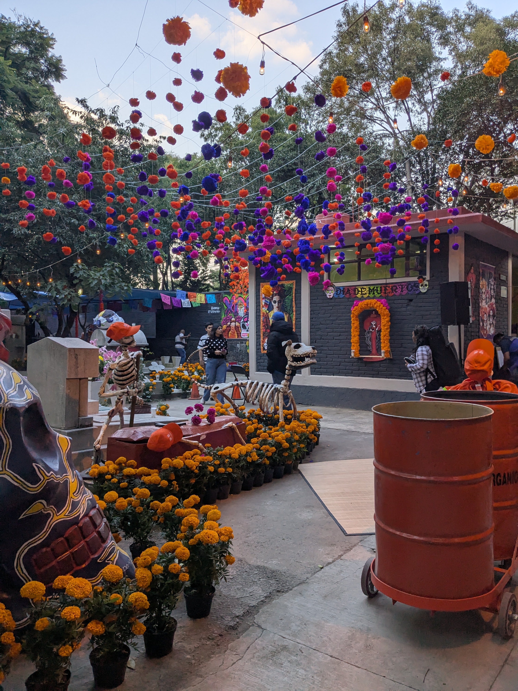

Another pocket is _March to mid-May_, before the rainy season but a bit hotter and worse air quality.

I haven't visited much outside of those windows, but these charts might help find another time:

[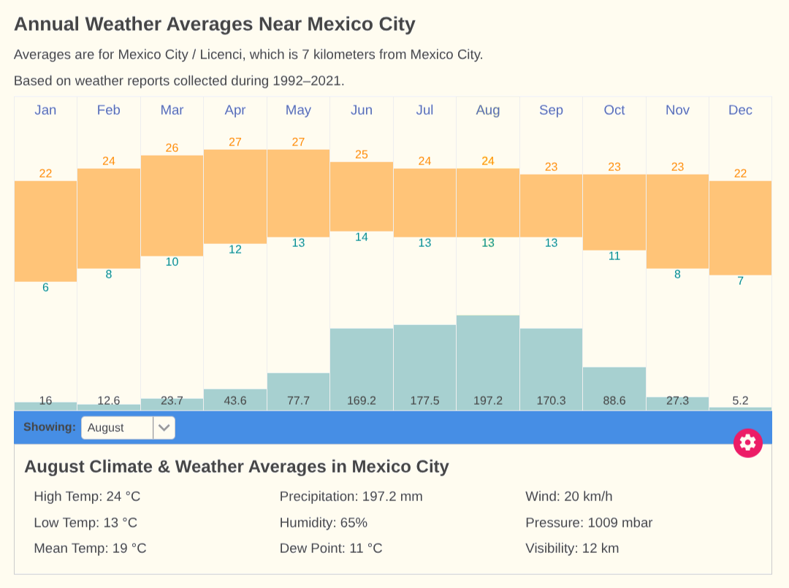](https://www.timeanddate.com/weather/mexico/mexico-city/climate)

[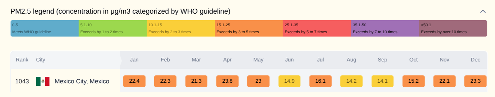](https://www.iqair.com/air-quality/mexico/mexico-city/mexico-city)

## How to get around

**Uber** always works. **DiDi** is similar but often cheaper and slightly worse, like the backseat might have crumbs on it.

Couple notes: (1) it's rude here to slam car doors; so be gentle when closing them and (2) sometimes they message ahead of time and ask you to pay them directly in cash ("efectivo"). Say "No, gracias. Por la app."

Don't be afraid to take the **Metrobús**, where you board from a raised platform. You'll need a transit card ("Tarjeta de Movilidad Integrada"), which you can buy and reload at most stations.

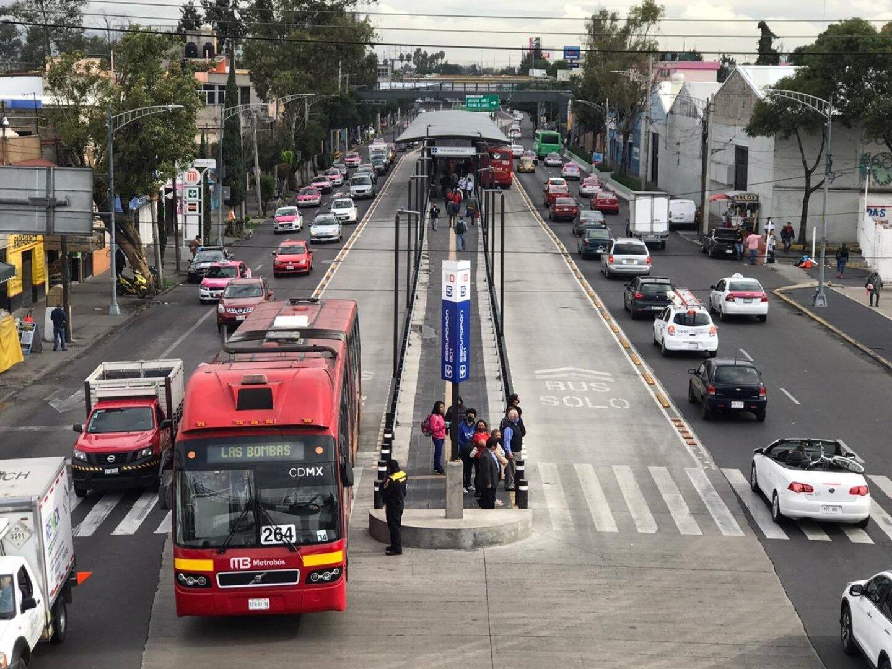

However, _don't_ take other buses like the RTP, where you board from the street.

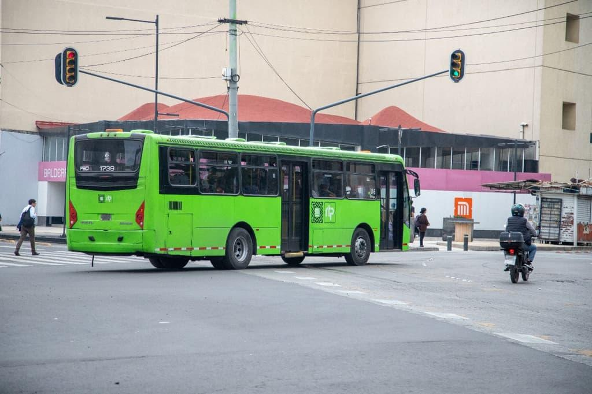

There's also the "**Metro**" subway which is a bit sketchier and crowded but very cheap. Consider it to Coyoacán, but otherwise it's not very useful. Just mind your phone and wallet.

## Tips

1. Brick-and-mortar spots mostly have tap-to-pay but **street food is always cash**. Not all ATMs accept foreign cards, so reference [this list](https://www.nomadicbackpacker.com/lowest-atm-withdrawal-fees-mexico.html).
2. Speaking of street food, **prefer busy stalls** where the food is served steaming hot. Though I always get food poisoning about ten days in.
3. Speaking of "la venganza de moctezuma", **don't drink the tap water**. Obviously you can still brush your teeth with it and everything, but buy bottles from convenience stores like Oxxo.
4. If you do get sick or need medicine, "Farmacias Similares" is everywhere and actually kinda fun to visit.
5. **Use bathrooms before you leave** cafes and restaurants -- public ones are pretty hard to find. But if you're already out on the street, search for the nearest Tierra Garat or other café.

## What to do

Below are the places I rated 4+ stars, sorted by neighborhood and activity. A ⭐ marks a 5-star review. You can also see them on [Google Maps](https://maps.app.goo.gl/wEjmSQZ3WqtZFWEf9).[^full-lists]

[^full-lists]: I've kinda autistically kept Google Maps lists of [literally everywhere I've been](https://maps.app.goo.gl/uMGL3c2kdX8JFRPM8) and [where I still want to go](https://maps.app.goo.gl/F7xJpBVUQCEBdNJc9).

I finish with a couple [excursions](#excursions). But again, just walking [the neighborhoods](#neighborhoods) without an itinerary is very worthwhile too.

If the list is overwhelming, here's a **quick itinerary**: spend a day wandering Roma Norte and La Condesa, then another around Centro Histórico and Bellas Artes. For a third, pick between Chapultepec or Coyoacán. For food, get a reservation at [Azul Histórico](https://www.google.com/maps?cid=10476380163657506574) and/or [Páramo](https://www.google.com/maps?cid=4062678597024693077), enfrijoladas for breakfast at [Cafetería ConSentido](https://www.google.com/maps?cid=157666573743236315), and be sure to have street tacos at [Los Rogacianos](https://www.google.com/maps?cid=10988942905818340560) followed by [Amorcita Gelato](https://www.google.com/maps?cid=14379694176472023946).

#### Chains

Quick aside: street markets ("_tianguis_") pop up around the city on different days. Someone made [a map of where and when they run](https://unpeaton.com/pensar-cosas-en-el-tianguis). I highly recommend checking out at least a couple, as convenient.

🌮 [Taquería Orinoco](https://www.google.com/maps?cid=17351953950497789372)\
Basically In-N-Out but tacos. The al pastor and chicharrón are best. Expect long lines at night.

🌮 [La Casa de Toño](https://www.google.com/maps?cid=16873123665803035727) ⭐\
Perfect for what it is, basically fast 24 hour diner food. I recommend the pozole and tacos de cochinita.

🌮 [Ojo de Agua](https://www.google.com/maps?cid=10578249706865809541)\
Beautiful ambience and good brunch food. I recommend the huevos tatemados and agua de piña.

☕️ [Tierra Garat](https://www.google.com/maps?cid=8148755669437122564) ⭐\
Basically Starbucks, but that means bathrooms and late hours.

#### Roma Norte

🏛️ [Aguafuerte Galería](https://www.google.com/maps?cid=7363898629604700045)\
Some really cool pieces to check out, and it's free.

🌮 [La Once Mil - Roma Norte](https://www.google.com/maps?cid=15443462195621783856) ⭐\
Beautiful location and definitely some of the best restaurant tacos.\
By taco: trompo 4/5, lechón 4/5, asada al carbón con costra 5/5, arrachera 3/5.\
There is another location in [Lomas](https://www.google.com/maps?cid=2393451917049199411), which also makes for an interesting walk through an upscale suburban neighborhood.

🌮 [Los Rogacianos de la Roma](https://www.google.com/maps?cid=10988942905818340560) ⭐\
The best street tacos I had. The pastor is crazy. Even the tripe is good, and I hate tripe. Nice guys with an impressive operation, so fast. I recommend ordering "dos tacos al pastor, uno de suadero y uno de tripa dorada."

🌮 [Páramo](https://www.google.com/maps?cid=4062678597024693077) ⭐\
Must go. I've been several times, and it's probably my favorite restaurant in the world.\
Ambience is 5/5: brick walls, candles, a glass roof, and art of animals doing human stuff. I love it. The crowd can feel a little tourist-heavy.\
By dish: Ceviche Chachalaca is 4/5, one of the best appetizers ever; Taco Costa Azul is 5/5, maybe the best taco I've ever had, with awesome contrasting flavors and textures; Taco Muñeca is 4/5; I also had the Taco Baja Norte and Taco Xochimilco, which are solid.\
Great drink selection too.

🌮 [Cafetería ConSentido Café](https://www.google.com/maps?cid=157666573743236315) ⭐\
The enfrijoladas are life-changing.

🌮 [Expendio de Maíz](https://www.google.com/maps?cid=9706918750662237026)\
Cool concept. It's like you and the whole restaurant are on the same tasting menu until you're full. Most dishes are delicious and they speak English. Definitely try it if you're here for more than a few days.

🌮 [The Ventanita Cafe](https://www.google.com/maps?cid=2765367688656309300)\
Cute eat-on-the-street breakfast spot, decent food.

🌮 [Tacos Chanito](https://www.google.com/maps?cid=9676775712913291483) ⭐\
I only had a taco campechano, but it was great and very cheap.

🌮 [Tacos Páramo](https://www.google.com/maps?cid=4999329284676898582) ⭐\
Fantastic pastor at an average price. The suadero is very good too. Both the red and green salsa are incredible.

🌮 [Taquitos de birria](https://www.google.com/maps?cid=2993210164197781859) ⭐\
Cheap and delicious birra. Three tacos with consomé was only 54 MXN.

🌮 [Papa Guapa](https://www.google.com/maps?cid=11900395057539597585) ⭐\
Hilarious place with great, unique drunk food.

🌮 [María la Pescadora](https://www.google.com/maps?cid=16476856649450254061)\
Fantastic tortillas, shrimp, and fish. The fried stuff has too much dough though.

🌮 [Máximo](https://www.google.com/maps?cid=7036648520158465067)\
We ordered the lengua, betabeles, cebolla, and pollo braseado. All great.

🌮 [Galanga](https://www.google.com/maps?cid=10455559191602130358)\
Great Thai restaurant.

🌮 [Mal de Cruz](https://www.google.com/maps?cid=5489874296118558061)\
Punk vibe brunch spot. Awesome enchiladas potosinas. La torta ahogada (clavada de carnitas) was kinda too wet and tomato-y.

🌮 [Hamburguesas a la Parrilla](https://www.google.com/maps?cid=11955201820109338122)\
Great street-food burgers, pretty cheap.

🌮 [C.O.M.E.](https://www.google.com/maps?cid=1443972159449919754)\
Izakaya-style spot with kind staff and the menu has fun daily items. Everything was very fresh tasting.

☕️ [MOMO Coffee - Roma Norte](https://www.google.com/maps?cid=17552623821401706554) ⭐\
Pretty excellent, with nice spots to work outside.

☕️ [Cafebrería El Péndulo Roma](https://www.google.com/maps?cid=8440005237272580464) ⭐\
Huge bookstore with good food and drinks. Great place to work or relax.

☕️ [Cara de Taza Café](https://www.google.com/maps?cid=10775684183476114083)\
Great coffee, cute place, fun mugs, fun bathroom.

☕️ [Xquenda Café](https://www.google.com/maps?cid=12231633865053944477)\
Great street coffee with some decent breakfast options.

☕️ [Cafe Brv](https://www.google.com/maps?cid=10012348079552662458)\
Definitely great coffee from a nice guy, but it's basically in this attic-like upstairs of a vintage clothing store.

☕️ [Palo de Rosa Café](https://www.google.com/maps?cid=1782448902180563532)\
Great prices and pastries in a decent interior.

☕️ [Café de Raíz](https://www.google.com/maps?cid=15638332721318394145)\
Great chilaquiles, okay tamal.

☕️ [Cafe Toscano](https://www.google.com/maps?cid=5926251410938262278)\
Quiet, romantic atmosphere. I just got a cheese plate and a cocktail while I worked.

☕️ [Bizcochería Bakery](https://www.google.com/maps?cid=13099327206685614993)\
If you visit in October, the pan de muerto relleno is fire 👌👌. Other items are still good. This would be a 5 if I were more of a pastry guy.

🍨 [Amorcita Gelato](https://www.google.com/maps?cid=14379694176472023946) ⭐\
Absolutely bussin', and they let you try the flavors unlike some other spots. When I first went, the café cardamom and pan de muerto were both fantastic. The employees are all super nice and the owner, Annarose, trained in Italy.

🍨 [Amorino](https://www.google.com/maps?cid=200479982264601720)\
Great cheesecake flavor, okay pistachio.

🍸️ [El Palenquito](https://www.google.com/maps?cid=962970031895835767)\
Good drinks and mezcal selection; nice ambiance.

🍸️ [Tlecan](https://www.google.com/maps?cid=14688874283863657510)\
[Ranked no. 20 on this best-bars list](https://archive.is/JH4Il).\
By drink: Tascalate: 4/5, super interesting but not gluggable or refreshing; Margarita: 4/5, excellent but not as interesting; Oceloyotl / Carajillo: kinda like a coffee-licorice flavor, not great; Pulque Colada: not bad, like a weird piña colada.

🕺 [Patrick Miller](https://www.google.com/maps?cid=1487692973016096160)\
So many people, long lines, but that pays off once you're inside and everyone is actually dancing.

💆 [Mudra massage Spa](https://www.google.com/maps?cid=8573068383471766543)\
Slightly pricey but fantastic couples massage.

#### Centro Histórico

🌲 [Alameda Central](https://www.google.com/maps?cid=15792169878685109824) ⭐\
It's the oldest park in the Americas and probably my favorite in the city. There's often salsa dancing at night.

🌲 [Zócalo](https://www.google.com/maps?cid=5548166858216125964) ⭐\
More impressive than most European plazas. This is where the president gives El Grito for Mexican Independence Day.

🏛️ [Palacio de Bellas Artes](https://www.google.com/maps?cid=1718141752200063183)\
Beautiful exterior and interior, especially the murals. Takes about an hour or two to enjoy. Tickets are inexpensive.

🏛️ [Memory and Tolerance Museum](https://www.google.com/maps?cid=8451174700132933873) \
Powerful imagery and articles about 20th century genocides. Almost everything is in Spanish though.

🏛️ [Casa de los Azulejos](https://www.google.com/maps?cid=626430939730553911)\
Beautiful historic building currently hilariously run by Sanborns.

🛍️ [Similandia Centro](https://www.google.com/maps?cid=11037453925537904886) \
Like a Dr. Simi indoor theme park.

🛍️ [Barrio Alameda](https://www.google.com/maps?cid=8603737048768226842)\
Cute small mall with nice, free bathrooms upstairs.

🌮 [Azul Histórico](https://www.google.com/maps?cid=10476380163657506574)\
Beautiful restaurant where you eat under a canopy of tall trees and candles. Delicious food for a reasonable price. I recommend ordering a mezcal, the sopa de tortilla, the camarones enchipoclados, and the enchiladas de mole negro oaxaqueño.

🌮 [Miralto Restaurante](https://www.google.com/maps?cid=18305184467473267103)\
NOT a must go, but the view is sweet and everything I ordered was decent: tapas españolas, ravioli, and ensalada Miralto.

☕️ [Casa Barista](https://www.google.com/maps?cid=5440849493609815865)\
Fast Wi-Fi for work and a pretty amazing horchata latte.

☕️ [CAFÉ DONDÉ](https://www.google.com/maps?cid=6345332313644051876)\
Very cute, friendly spot with a beautiful courtyard in the back.

☕️ [OTROCAFÉ](https://www.google.com/maps?cid=4171339807763014941)\
Nice vibe and good coffee.

🕺 [SUNDAY SUNDAY](https://www.google.com/maps?cid=7795721897156883627)\
4/5 if you like house, 5/5 if you also don't mind the drink prices. Cool city views in a warehouse-like space. Check [their Instagram](https://www.instagram.com/sundaysundaymx) to see if / who's playing.

🕺 [La Purísima](https://www.google.com/maps?cid=3523281278814145925)\
4/5. Lots of bangers, cheap drinks, fun people, fun vibe. It was stupid packed, though. With 15% fewer people, it'd be a 5/5 so probably worth arriving around 10 PM.

#### La Condesa

🌲 [Parque México](https://www.google.com/maps?cid=12408141702709851923) ⭐\
Very pretty with lots of dogs and dancing. One time there was even street massages 😅.

🌲 [Parque España](https://www.google.com/maps?cid=17122287652374259797)\
Basically a great sidekick to Parque México.

🌮 [Creperie de la Paix](https://www.google.com/maps?cid=18173741977434119587) ⭐\
Great brunch spot on a beautiful patio. The bread and sauces are amazing, the crepa de salmón ahumado is great, and they make the café francés in front of you. The bread and its sauces are amazing, and the crepa de salmón ahumado was also great.

🌮 [El Tizoncito, Creadores del Taco al Pastor](https://www.google.com/maps?cid=2285017846735180902)\
Very solid tacos.

🌮 [La Capital](https://www.google.com/maps?cid=6612934038617157125)\
Great plating and good food, but at US prices and the interior feels pretty American too.\
By dish: Shrimp tacos: 3/5, almost amazing but with way too much tangy mayo; duck mole: 5/5, delicious and mild; El Jarrito sin alcohol: 5/5, fun orange juice.\
It was a lot of food for one but would've been a great amount for two.

🌮 [El Pescadito](https://www.google.com/maps?cid=15972721131210922249)\
Solid fish tacos.\
By dish: Camarones: amazing, 5/5; Marlitún: interesting and good, 4/5; Campechano: kinda dry, but there's a lot of meat and plenty of salsa, 3/5.

☕️ [Nils ı Café de especialidad y Gente Increíble](https://www.google.com/maps?cid=11520579790346688947)\
Cute and tiny coffee spot.

☕️ [Clarice Café y Literatura](https://www.google.com/maps?cid=14206164698003810757)\
Great spot to work, decent coffee.

🍸️ [Shhh Condesa](https://www.google.com/maps?cid=2598313468967045633)\
The listening room has awesome speakers and a great vibe. You can see the upcoming schedule on [their Instagram](https://www.instagram.com/shhh99r/). The drinks are great and only slightly pricey. It is pretty small, though, so the waitlist can be long.

#### Coyoacán

🌲 [Plaza de la Conchita](https://www.google.com/maps?cid=6185114179664068242)\
Very quiet, with lots of benches. A little worn, but in a charming way.

🌲 [Jardín Centenario](https://www.google.com/maps?cid=12294291060137186165)\
Very pleasant, with beautiful buildings around it, not too many vendors like some parks, and a refreshingly unusual fountain.

🛍️ [Coyoacán Market](https://www.google.com/maps?cid=8638990294780037140)\
Tight, chaotic market for food and trinkets.\
Inside, I've tried [Madre cocina mexicana](https://www.google.com/maps?cid=5063435575765771659) which had smooth and delicious "chilaquiles rellenos de cochinita" and [Antojitos Sandy](https://www.google.com/maps?cid=1515951601793665899) which had great flavors.

🎥 [Cineteca Nacional de México](https://www.google.com/maps?cid=10872121521345494402) ⭐\
Sick movie theater, cheap tickets, and especially cool outdoor spaces and architecture. No reclining seats, but otherwise as comfy as possible. If you like movies, it is absolutely worth a stop while in Coyoacán. The [café inside](https://www.google.com/maps?cid=18439429211190296022) has comfy chairs, fast Wi-Fi, and outlets, so it's a great place to wait for a movie.

🌮 [Taquería Pepe Coyotes Coyoacán](https://www.google.com/maps?cid=3990272153993931151)\
Huge alambres that are pretty solid.

☕️ [Café Ruta de la Seda](https://www.google.com/maps?cid=11480114762496570951)\
Beautiful corner facing a park, with a pleasant patio and great food. I got a Cuban sandwich which was subtly sweet and sour. It's apparently CDMX's first organic bakery and pastry shop.

#### Chapultepec

🏛️ [Museo Nacional de Antropología](https://www.google.com/maps?cid=9521483601320789284)\
Enormous museum with archaeological artifacts from across Mexico. Only some sections have English translations, but still worth seeing.

🏛️ [Chapultepec Castle](https://www.google.com/maps?cid=12024611576922344242)\
It's cool! I didn't _love_ it, but I had high expectations compared to European castles. Nonetheless, it has beautiful views of Chapultepec and Reforma.

#### Reforma

🌲 [BiciGratis](https://www.google.com/maps?cid=5316132429939122806)\
Every Sunday morning, Paseo de la Reforma closes to cars, and people bike, run, and skate along a route that can stretch from Chapultepec to the Basilica. Show up here by 9 AM for a good chance at a bike, which you can borrow for free if you fill out a form and leave an ID. If they run out though, there are other free-bike stands along the route too.

🏛️ [The Angel of Independence](https://www.google.com/maps?cid=7797541911528484855)\
Dope statue, usually with lots of vendors on the sidewalk.

🌮 [El Progreso](https://www.google.com/maps?cid=3127146446858298209)\
The best steak tacos, especially with cheese and onions and rajas. Though not as cheap as other spots and the tortillas are rather bland.

🌮 [Barbacoa Edison](https://www.google.com/maps?cid=2830852647967664651)\
Delicious tacos and consomé. I got two campechano tacos (lamb + intestine) and two barbacoa tacos.

🌮 [Ling Ling by Hakkasan](https://www.google.com/maps?cid=9538561265921944406)\
Best view of the city I've had. The food is very good but not fantastic, so I'd call it overpriced. However, the cocktail "El Pequeño Problema" was maybe the best I've ever had. So I'd come back just for cocktails at the bar and some dumplings.

#### Juárez

🛍️ [Libre liebre](https://www.google.com/maps?cid=8988197666373730117)\
Incredible, creative local art.

🌮 [TierrAdentro CDMX](https://www.google.com/maps?cid=6696604122617277425)\
Decent food, good place to hang, bathroom is WILD.

🌮 [Caminito a Oaxaca](https://www.google.com/maps?cid=7908602418560482660)\
Great mole, great price, cute interior, nice people.

🌮 [Taquitos de Mixiote Castelan](https://www.google.com/maps?cid=6977566685832787794)\
Very smooth tacos. Mixiote should be more popular.

🍨 [Joe Gelato](https://www.google.com/maps?cid=15478889601796955355)\
Pretty good, though I find it hard to recommend a spot that doesn't give free samples. At least you can combine three flavors though. I got cajeta, cempasúchil, and pan de muerto.

🍸️ [Handshake Speakeasy](https://www.google.com/maps?cid=14109173404258449887)\
Rated [world's best bar in 2024](https://www.the50.com/stories/News/the-worlds-50-best-bars-2024-list.html)\
Most cocktails were interesting; some were among the best I've ever had. The only downside was the music: a little too loud and basically Kendrick Lamar Spotify radio, which didn't fit the vibe. Best drinks in terms of flavor: Matcha Dame, Cariño, Butter Mushroom Old Fashioned, Once Upon a Time in Oaxaca, Piña Colada, and Mexi-Thai.

#### Polanco

🏛️ [Museo Soumaya](https://www.google.com/maps?cid=10624803107852467379) ⭐\
Free museum with interesting architecture and plenty of beautiful, mostly European art inside.

🌲 [Avenida Horacio](https://www.google.com/maps?cid=15514818207340368317) ⭐\
Peaceful, with nice walkways. Some guy was playing the flute.

🛍️ [Pasaje Polanco](https://www.google.com/maps?cid=12578839175042772561)\
Upscale and peaceful. Feels like Europe.

🛍️ [Walmart Express](https://www.google.com/maps?cid=643171249601766804)\
Respect to Mexico for having nice Walmart bathrooms.

🌮 [El Turix](https://www.google.com/maps?cid=8514827355891559870) ⭐\
Cheap, tender, fast, delicious tacos de cochinita pibil.

🌮 [Hooters](https://www.google.com/maps?cid=12108051550358255612)\
The only place that reliably shows sports, and it's fun to see what NFL teams people root for.

#### Santa María la Ribera

🏨 [Hotel casa de nina](https://www.google.com/maps?cid=13208917147730173266)\
Great place to stay if it's not your first time in CDMX. Super pretty, and I proposed to my fiancée here!

🏛️ [Biblioteca Vasconcelos](https://www.google.com/maps?cid=12337640721315742525)\
Definitely a cool walkthrough, but you can also just look at photos. Not a must-visit.

🌮 [Sazón Oaxaqueño](https://www.google.com/maps?cid=5332554960813680546) ⭐\
The owner, Aaron, is super friendly, and serves probably the best-value mole in the city. Freaking 5 USD for great mole.

🌮 [Cuenco Verde](https://www.google.com/maps?cid=14762378875461132528)\
Great breakfast spot with delicious chilaquiles Maya.

🌮 [Kabuki Sushi](https://www.google.com/maps?cid=16862783626046479893)\
Weekdays are two rolls for 198 MXN. Tasty and amazing value.

☕️ [Uroboros Alquimia con Café](https://www.google.com/maps?cid=15313297692492405370)\
Good drinks, great art, a friendly neighborhood vibe, and a beautiful cat named Felipa. Pretty bad bathroom though.

☕️ ["Sofi" Panadería](https://www.google.com/maps?cid=17703802663904390243)\
Cool, tiny bakery with incredible pan de muerto. I also got a cubilete, which was decent.

☕️ [Alebrije Café](https://www.google.com/maps?cid=3317737876121416564)\
Nice people, interesting space, tasty bagel sandwich, comfy spot to work.

#### Tepito

🛍️ [Tianguis La Lagunilla](https://www.google.com/maps?cid=1003923946432277311)\
Worth a visit on Sundays around 11 AM to 2 PM, with tons of street vendors, food, and art. I walked from here to the [Letras de Tepito](https://www.google.com/maps?cid=9634596570507595755).

#### Roma Sur, Escandón, Nápoles, and Narvarte

🌲 [Parque Hundido](https://www.google.com/maps?cid=15207199447342577156)\
I've never seen another park like it. It feels enormous, with many distinct sections. Would be worth checking out especially if there's an event, though some parts feel poorly maintained.

🌮 [El Vilsito](https://www.google.com/maps?cid=16740546902627837206)\
Great, slightly smoky al pastor. The meat wasn't tender, but fantastic salsa made up for it.

🌮 [Barbacoa El Dany's](https://www.google.com/maps?cid=8770180752094522156)\
Amazing tortillas and tender meat.

#### Other places around CDMX

🏛️ [Basilica of Our Lady of Guadalupe](https://www.google.com/maps?cid=2423194957463972528)\
Worth considering even if you're not Catholic for the architecture and landscaping and city views. It houses Juan Diego's tilma which is one of Mexico's most important religious symbols.

🎨 [Ex Fábrica MX](https://www.google.com/maps?cid=8410188808404920990)\
Cool concept of a graffiti'd professional graffiti artists refresh refresh the art each year. Many spaces were closed when I went during the day, so probably better in the evening.

### Excursions

I only detail two here: Xochimilco which is still within CDMX, and Teotihuacán which is in the surrounding State of Mexico.

If you have even more time, consider visiting other states and "pueblos mágicos" like Hidalgo with [Omitlán](https://maps.app.goo.gl/3wshmTQkr1eUUZoT8), [Real del Monte](https://maps.app.goo.gl/T87uPbcb4TqzL85D6), and [Los Prismas Basálticos](https://maps.app.goo.gl/rAhWrBnZ9SkRyU5U9), or Morelos with [Tepoztlán](https://maps.app.goo.gl/ZF54NsPYjiDLUmvP6), or even the next big city, [Puebla](https://maps.app.goo.gl/ypmUsMVjBfnXASmS9).

#### Xochimilco

In the far southeast of the city, there's still a maze of canals and chinampas. Absolutely worth a visit if you're here for more than a few days. There are three good ways to experience it:

1. As a large drunken group. Bring lots of friends and food and drinks to [Embarcadero Nuevo Nativitas](https://www.google.com/maps?cid=18227576249178908905) and hire a trajinera.[^flat-rate]

[^flat-rate]: You pay a flat rate for the whole boat, not per person. When I went, it was 1,500 MXN for a two-hour ride.

2. Same idea, less drunk, more chill: [Embarcadero Cuemanco](https://www.google.com/maps?cid=3956850909224153812).

3. Get up very early and kayak: [Recorridos Kayak Xochimilco](https://www.google.com/maps?cid=9631039241424442038) (Spanish-only when I went but there should be other English tours available).

#### Teotihuacán

Uber about an hour to explore the ruins and pyramids of an ancient city that housed 100,000+ people. It had apartments and a wastewater system!

I recommend this itinerary:

1. Arrive very early for a [hot air balloon](https://skyballoons.mx) ride (book ahead of time).
2. Walk around the ruins for a couple hours. Consider hiring a guide, though I just had ChatGPT voice guide me.
3. Eat at [La Gruta](https://maps.app.goo.gl/2sfRDdUS5oGKhj4x6), a restaurant inside a cave. It's a bit pricey but has incredible mole and pre-Hispanic dishes like escamoles (ant eggs).

---

Thanks for reading! I hope this guide helps you love CDMX as much as I do. Please message if you're going, have any questions, or know of any other incredible places!
