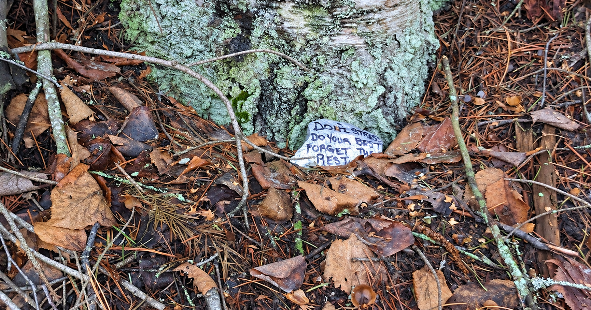

I'm super lucky to take yearly Canadian ski trips with friends.

Not really a postcard ski vacation though. Interior British Columbia is quite industrial, so the resorts are surrounded by logging and smelting operations and we basically stay in Isengard for half the trip.

Between the Revelstoke and Red Mountain resorts, the road is split and we take this big steel ferry.

In 2023, while waiting for that ferry, we spotted this painted rock on the side of the road: **DON'T STRESS, DO YOUR BEST, FORGET THE REST.** That still repeats in my head when I need it. Thanks rock 🥹

So that's in my top five from 2023. Below are the other snippets, often about relationships, love and self-love, and consciousness.

As before, you can read just the top five or use the navigation between headings to go deeper. I'll back-publish 2024-2026 in the remaining three months this year.

## 2023

- Fundamental attribution error: people tend to make decisions based on circumstance rather than what we assume is their personality
- Decisions become easy once you've decided what's important
- "What would it look like if this was fun?"
- https://ava.substack.com/p/having-fun
  - "You have to do the thing you actually enjoy doing, not the thing you find conceptually exciting. You have to date the person you actually like, not the ideal of perfection you fetishize in your mind. And you have to have enough self-knowledge to know what you enjoy."
  - "The couples I admire most seem like they're having fun. That's literally it... But honestly [most don't]. They seemed bored. Or stressed? Or one person wants more but the other doesn't want to give it... [They are] probably often stressed out and fight and disappoint each other, but there really is this thoroughline of playfulness, of really having a great time with the other person, that I think a lot of relationships lack."
- Don't stress, do your best, forget the rest

### Q4

<small>~~prev~~ | [next](#q3) | [parent](#2023)</small>

- Measure your success against others and you'll be unhappy when they win. So measure your success against yourself. It's also more fun to be a fan than a critic.
- Thought: general intelligence emerges from a system that is complex enough to be isomorphic to the outside world or at least plastic enough to become more isomorphic when it's wrong
- <small>☆</small> Fundamental attribution error: people tend to make decisions based on circumstance rather than what we assume is their personality
- Two rules for life: (1) The person who has the most fun wins. (2) The climb is the fun part.
- <small>☆</small> Decisions become easy once you've decided what's important

#### Dec

<small>~~prev~~ | [next](#nov) | [parent](#q4)</small>

- Sometimes zooming out and creating important milestones en route to the end goal helps me find things to "tick off" and celebrate on the way
- When the data and the anecdotes disagree, the anecdotes are usually right, and you should double check that you're measuring the right thing\
  https://youtu.be/DcWqzZ3I2cY?t=1h34m
- Better meeting system: pre-write and post a topic, pre-require comments, meeting only permits commenting members for further clarification, decision, or feedback, which should always be synchronous\
  https://youtu.be/3e0x0Jgs4lA
- <small>☆</small> Measure your success against others and you'll be unhappy when they win. So measure your success against yourself. It's also more fun to be a fan than a critic.
- <small>☆</small> Thought: general intelligence emerges from a system that is complex enough to be isomorphic to the outside world or at least plastic enough to become more isomorphic when it's wrong

##### Week 5

<small>~~prev~~ | [next](#dec-week-4) | [parent](#dec)</small>

- <small>☆</small> Sometimes zooming out and creating important milestones en route to the end goal helps me find things to "tick off" and celebrate on the way
- How are you supposed to make rapid or radical change without trusted tests?\
  https://youtu.be/dNrTrx42DGQ

###### 2023-12-24

- <small>☆</small> Sometimes zooming out and creating important milestones en route to the end goal helps me find things to "tick off" and celebrate on the way
- <small>☆</small> How are you supposed to make rapid or radical change without trusted tests?\
  https://youtu.be/dNrTrx42DGQ

##### Week 4

<small>[prev](#dec-week-5) | [next](#dec-week-3) | [parent](#dec)</small>

- https://youtu.be/nWTvXbQHwWs
  - If you don't model the complexity, then you're pushing that complexity outwards
  - If a new leader replaces a founder, it's hard to justify changes to yourself and your constituents
- Consciousness seems like an imprecise way of describing sufficiently complex computation\
  https://youtu.be/f-08IkK0UxM
- Protons are not balls, but a ripple of quarks\
  https://youtu.be/Z_1Q0XB4X0Y
- <small>☆</small> When the data and the anecdotes disagree, the anecdotes are usually right, and you should double check that you're measuring the right thing\
  https://youtu.be/DcWqzZ3I2cY?t=1h34m
- Wisdom = knowing the right thing in any situation, AI can be wiser than us, perhaps in LLMs using fine-tuning against a moral graph
  meaningalignment.org

###### 2023-12-20

- <small>☆</small> https://youtu.be/nWTvXbQHwWs
  - If you don't model the complexity, then you're pushing that complexity outwards
  - If a new leader replaces a founder, it's hard to justify changes to yourself and your constituents

###### 2023-12-19

- <small>☆</small> Consciousness seems like an imprecise way of describing sufficiently complex computation\
  https://youtu.be/f-08IkK0UxM
- <small>☆</small> Protons are not balls, but a ripple of quarks\
  https://youtu.be/Z_1Q0XB4X0Y

###### 2023-12-18

- <small>☆</small> When the data and the anecdotes disagree, the anecdotes are usually right, and you should double check that you're measuring the right thing\
  https://youtu.be/DcWqzZ3I2cY?t=1h34m

###### 2023-12-17

- <small>☆</small> Wisdom = knowing the right thing in any situation, AI can be wiser than us, perhaps in LLMs using fine-tuning against a moral graph
  meaningalignment.org

###### 2023-12-16

- Fast decisions = fast velocity, individuals can make reversible decisions, leaders make hard-to-reverse decisions, where they strive for truth but can "disagree but commit" if truth isn't attainable
- Engineering is just the scope of things which we can measure and control

##### Week 3

<small>[prev](#dec-week-4) | [next](#dec-week-2) | [parent](#dec)</small>

- Tech is adopted if it solves a problem and is easy to adopt\
  https://youtu.be/pdJQ8iVTwj8

###### 2023-12-12

- <small>☆</small> Tech is adopted if it solves a problem and is easy to adopt\
  https://youtu.be/pdJQ8iVTwj8

##### Week 2

<small>[prev](#dec-week-3) | [next](#dec-week-1) | [parent](#dec)</small>

- <small>☆</small> Better meeting system: pre-write and post a topic, pre-require comments, meeting only permits commenting members for further clarification, decision, or feedback, which should always be synchronous\
  https://youtu.be/3e0x0Jgs4lA
- What's the criteria for being allowed to take something apart? If a robot knocks on your door, says "nice to meet you I'm Christmas caroling", are you allowed to abduct it and take it apart?
- https://youtu.be/p3lsYlod5OU
  - Michael Levin's work is about training cells, implications for regenerative medicine and our understanding of cognition
  - Cells have agency, agency can exist at different levels, you can engineer by working at different levels, and evolution does while relying on implicit universal physics and geometry and logic
  - If intelligence is "can achieve the same goal through different means", cell biology has it: it tolerates many different configurations
  - Is it still magic if you know how the trick is performed? People think the same way about intelligence. The magic is not knowing how it works.
  - Advice: read broadly, work hard, know what you're talking about, consider specific small advice, ignore the rest -- even smart people will tell you to go a completely different way
- <small>☆</small> Measure your success against others and you'll be unhappy when they win. So measure your success against yourself. It's also more fun to be a fan than a critic.
- Experience this one thing for what it is, not what you think it is. Be open to what the world is telling you. Life is nothing more than a stream of experiences -- the more widely and deeply you swim in it, the richer your life will be.

###### 2023-12-08

- <small>☆</small> Better meeting system: pre-write and post a topic, pre-require comments, meeting only permits commenting members for further clarification, decision, or feedback, which should always be synchronous\
  https://youtu.be/3e0x0Jgs4lA
- <small>☆</small> What's the criteria for being allowed to take something apart? If a robot knocks on your door, says "nice to meet you I'm Christmas caroling", are you allowed to abduct it and take it apart?
- <small>☆</small> https://youtu.be/p3lsYlod5OU
  - Michael Levin's work is about training cells, implications for regenerative medicine and our understanding of cognition
  - Cells have agency, agency can exist at different levels, you can engineer by working at different levels, and evolution does while relying on implicit universal physics and geometry and logic
  - If intelligence is "can achieve the same goal through different means", cell biology has it: it tolerates many different configurations
  - Is it still magic if you know how the trick is performed? People think the same way about intelligence. The magic is not knowing how it works.
  - Advice: read broadly, work hard, know what you're talking about, consider specific small advice, ignore the rest -- even smart people will tell you to go a completely different way

###### 2023-12-07

- <small>☆</small> Measure your success against others and you'll be unhappy when they win. So measure your success against yourself. It's also more fun to be a fan than a critic.

###### 2023-12-03

- <small>☆</small> Experience this one thing for what it is, not what you think it is. Be open to what the world is telling you. Life is nothing more than a stream of experiences -- the more widely and deeply you swim in it, the richer your life will be.
- He who writes for fools always finds a large public

##### Week 1

<small>[prev](#dec-week-2) | [next](#nov-week-4) | [parent](#dec)</small>

- "toSorted" is JS' new immutable sort\
  https://youtu.be/ANCm3oG7htM?t=74
- <small>☆</small> Thought: general intelligence emerges from a system that is complex enough to be isomorphic to the outside world or at least plastic enough to become more isomorphic when it's wrong
- AI agents are a tool ripe for misuse or misunderstanding. We hopefully survive until there's an aligned AI that doesn't tolerate malevolent AIs and rules us in a system where we are forced to cooperate. And hopefully we don't give up our own humanity along the way in the same way we choose convenience over climate change.\
  https://youtu.be/bk-nQ7HF6k4
- Thought: part of the excitement with human art and accomplishment is imagining yourself in their shoes, becoming familiar with their process, being inspired to do better. You can't do that on a deep level with an AI.
- "You waste years by not being able to waste hours." -- You need to periodically do hard leisure and ask, "how should I spend my time?"

###### 2023-11-28

- <small>☆</small> "toSorted" is JS' new immutable sort\
  https://youtu.be/ANCm3oG7htM?t=74
- <small>☆</small> Thought: general intelligence emerges from a system that is complex enough to be isomorphic to the outside world or at least plastic enough to become more isomorphic when it's wrong

###### 2023-11-27

- <small>☆</small> AI agents are a tool ripe for misuse or misunderstanding. We hopefully survive until there's an aligned AI that doesn't tolerate malevolent AIs and rules us in a system where we are forced to cooperate. And hopefully we don't give up our own humanity along the way in the same way we choose convenience over climate change.\
  https://youtu.be/bk-nQ7HF6k4
- <small>☆</small> Thought: part of the excitement with human art and accomplishment is imagining yourself in their shoes, becoming familiar with their process, being inspired to do better. You can't do that on a deep level with an AI.

###### 2023-11-25

- <small>☆</small> "You waste years by not being able to waste hours." -- You need to periodically do hard leisure and ask, "how should I spend my time?"

#### Nov

<small>[prev](#dec) | [next](#oct) | [parent](#q4)</small>

- The imperfect project you actually complete is worth more than the perfect project you never finish.
- You should only receive 50 millisieverts per year. Living in Denver = 2 per year. One CT scan usually equals 20.
- Many nobel prizes and great works come from pairs\
  https://www.newyorker.com/magazine/2018/12/10/the-friendship-that-made-google-huge
- Jokes in dark places help rediscover the light
- https://youtu.be/o5z8-9Op2nM
  - The role of marriage is overblown -- your spouse must be your best friend, co-parent, travel partner, provider, romantic partner, otherwise they're not your soulmate and you'd be happier elsewhere
  - Get a prenup and if you can't have that conversation you're already doomed
  - It's small maintenance: buying their favorite snack, making them coffee...

##### Week 4

<small>[prev](#dec-week-1) | [next](#nov-week-3) | [parent](#nov)</small>

- Stable Diffusion: We basically taught the algorithm what a captioned image looks like as it gets more and more grainy and latent. Then we ask it to do the reverse from random noise.
- Consciousness could just be that your model of the world includes yourself\
  https://youtu.be/cdiD-9MMpb0
- <small>☆</small> The imperfect project you actually complete is worth more than the perfect project you never finish.

###### 2023-11-22

- <small>☆</small> Stable Diffusion: We basically taught the algorithm what a captioned image looks like as it gets more and more grainy and latent. Then we ask it to do the reverse from random noise.

###### 2023-11-20

- <small>☆</small> Consciousness could just be that your model of the world includes yourself\
  https://youtu.be/cdiD-9MMpb0

###### 2023-11-18

- <small>☆</small> The imperfect project you actually complete is worth more than the perfect project you never finish.

##### Week 3

<small>[prev](#nov-week-4) | [next](#nov-week-2) | [parent](#nov)</small>

- <small>☆</small> You should only receive 50 millisieverts per year. Living in Denver = 2 per year. One CT scan usually equals 20.
- GPT-4 passes the turing test ~40% of the time. In the same exam, people only convinced others they were real ~60% of the time.
- <small>☆</small> Many nobel prizes and great works come from pairs\
  https://www.newyorker.com/magazine/2018/12/10/the-friendship-that-made-google-huge

###### 2023-11-18

- <small>☆</small> You should only receive 50 millisieverts per year. Living in Denver = 2 per year. One CT scan usually equals 20.

###### 2023-11-12

- <small>☆</small> GPT-4 passes the turing test ~40% of the time. In the same exam, people only convinced others they were real ~60% of the time.
- <small>☆</small> Many nobel prizes and great works come from pairs\
  https://www.newyorker.com/magazine/2018/12/10/the-friendship-that-made-google-huge

##### Week 2

<small>[prev](#nov-week-3) | [next](#nov-week-1) | [parent](#nov)</small>

- <small>☆</small> Jokes in dark places help rediscover the light
- "The shortest pencil is longer than the longest memory"

###### 2023-11-08

- <small>☆</small> Jokes in dark places help rediscover the light

###### 2023-11-07

- <small>☆</small> "The shortest pencil is longer than the longest memory"

##### Week 1

<small>[prev](#nov-week-2) | [next](#oct-week-4) | [parent](#nov)</small>

- <small>☆</small> https://youtu.be/o5z8-9Op2nM
  - The role of marriage is overblown -- your spouse must be your best friend, co-parent, travel partner, provider, romantic partner, otherwise they're not your soulmate and you'd be happier elsewhere
  - Get a prenup and if you can't have that conversation you're already doomed
  - It's small maintenance: buying their favorite snack, making them coffee...

###### 2023-10-30

- <small>☆</small> https://youtu.be/o5z8-9Op2nM
  - The role of marriage is overblown -- your spouse must be your best friend, co-parent, travel partner, provider, romantic partner, otherwise they're not your soulmate and you'd be happier elsewhere
  - Get a prenup and if you can't have that conversation you're already doomed
  - It's small maintenance: buying their favorite snack, making them coffee...

#### Oct

<small>[prev](#nov) | [next](#sep) | [parent](#q4)</small>

- It's hard to build a happy marriage if you marry an unhappy person
- <small>☆</small> Fundamental attribution error: people tend to make decisions based on circumstance rather than what we assume is their personality
- <small>☆</small> Two rules for life: (1) The person who has the most fun wins. (2) The climb is the fun part.
- Make grand plans to spur action, but take little actions so you don't make grand mistakes
- <small>☆</small> Decisions become easy once you've decided what's important

##### Week 4

<small>[prev](#nov-week-1) | [next](#oct-week-3) | [parent](#oct)</small>

- <small>☆</small> It's hard to build a happy marriage if you marry an unhappy person

###### 2023-10-22

- <small>☆</small> It's hard to build a happy marriage if you marry an unhappy person

##### Week 3

<small>[prev](#oct-week-4) | [next](#oct-week-2) | [parent](#oct)</small>

- Include a margin of safety similar to bridges and you too won't have your systems collapse
- As in war, it's valuable to "see the front" before making decisions, rather than relying only on reports
- <small>☆</small> Fundamental attribution error: people tend to make decisions based on circumstance rather than what we assume is their personality

###### 2023-10-16

- <small>☆</small> Include a margin of safety similar to bridges and you too won't have your systems collapse
- <small>☆</small> As in war, it's valuable to "see the front" before making decisions, rather than relying only on reports
- <small>☆</small> Fundamental attribution error: people tend to make decisions based on circumstance rather than what we assume is their personality

##### Week 2

<small>[prev](#oct-week-3) | [next](#oct-week-1) | [parent](#oct)</small>

- <small>☆</small> Two rules for life: (1) The person who has the most fun wins. (2) The climb is the fun part.
- The best founders focus only on hiring SWEs, and the occasional (part time?) product designer and absorb all the "non-technical" work themselves

###### 2023-10-12

- <small>☆</small> Two rules for life: (1) The person who has the most fun wins. (2) The climb is the fun part.
- <small>☆</small> The best founders focus only on hiring SWEs, and the occasional (part time?) product designer and absorb all the "non-technical" work themselves

##### Week 1

<small>[prev](#oct-week-2) | [next](#sep-week-4) | [parent](#oct)</small>

- <small>☆</small> Make grand plans to spur action, but take little actions so you don't make grand mistakes
- <small>☆</small> Decisions become easy once you've decided what's important

###### 2023-10-05

- <small>☆</small> Make grand plans to spur action, but take little actions so you don't make grand mistakes

###### 2023-10-02

- <small>☆</small> Decisions become easy once you've decided what's important

### Q3

<small>[prev](#q4) | [next](#q2) | [parent](#2023)</small>

- A library is a good place to go when you feel unhappy, for there, in a book, you may find encouragement and comfort. A library is a good place to go when you feel bewildered or undecided, for there, in a book, you may have your question answered.
- Find the beauty and joy in your daily rituals and you will find beauty and joy in your daily life. To love your habits is to love your days, and to love your days is to love your life.
- 1 million seconds ~ 12 days, 1 billion ~ 32 years, 1 trillion ~ 32k years... people can't easily comprehend large numbers
- <small>☆</small> "What would it look like if this was fun?"
- Choose convex payoffs, where the upside of success is greater than the downside of failure and failure cannot lead to ruin. Experiment, don't plan.

#### Sep

<small>[prev](#oct) | [next](#aug) | [parent](#q3)</small>

- <small>☆</small> A library is a good place to go when you feel unhappy, for there, in a book, you may find encouragement and comfort. A library is a good place to go when you feel bewildered or undecided, for there, in a book, you may have your question answered.
- <small>☆</small> Find the beauty and joy in your daily rituals and you will find beauty and joy in your daily life. To love your habits is to love your days, and to love your days is to love your life.
- "Never forget that absolutely everything you do is for your customers. Make every decision -- even decisions about whether to expand the business, raise money, or promote someone -- according to what's best for your customers. If you're ever unsure what to prioritize, just ask your customers the open-ended question, "How can I best help you now?" Then focus on satisfying those requests... It's counterintuitive, but the way to grow your business is to focus entirely on your existing customers. Just thrill them, and they'll tell everyone."
- Good incentives mean the person doing the work bears the consequences and reaps the reward
- When you're doing something hard, focus on the fun part. Forget that running is hard or math is hard. Think about how good it feels to move your body, or don't think and get into a meditative rhythm. Just don't repeat this mental story about how hard it is to do the thing. Work hard, but with the fun part in mind.

##### Week 4

<small>[prev](#oct-week-1) | [next](#sep-week-3) | [parent](#sep)</small>

- <small>☆</small> A library is a good place to go when you feel unhappy, for there, in a book, you may find encouragement and comfort. A library is a good place to go when you feel bewildered or undecided, for there, in a book, you may have your question answered.
- <small>☆</small> Find the beauty and joy in your daily rituals and you will find beauty and joy in your daily life. To love your habits is to love your days, and to love your days is to love your life.

###### 2023-09-24

- <small>☆</small> A library is a good place to go when you feel unhappy, for there, in a book, you may find encouragement and comfort. A library is a good place to go when you feel bewildered or undecided, for there, in a book, you may have your question answered.
- <small>☆</small> Find the beauty and joy in your daily rituals and you will find beauty and joy in your daily life. To love your habits is to love your days, and to love your days is to love your life.

##### Week 3

<small>[prev](#sep-week-4) | [next](#sep-week-1) | [parent](#sep)</small>

- <small>☆</small> "Never forget that absolutely everything you do is for your customers. Make every decision -- even decisions about whether to expand the business, raise money, or promote someone -- according to what's best for your customers. If you're ever unsure what to prioritize, just ask your customers the open-ended question, "How can I best help you now?" Then focus on satisfying those requests... It's counterintuitive, but the way to grow your business is to focus entirely on your existing customers. Just thrill them, and they'll tell everyone."
- <small>☆</small> Good incentives mean the person doing the work bears the consequences and reaps the reward
- Brevity is overrated. Don't mistake a summary for the truth. We don't know all of the world's rules. We can only wait for the surprising consequences we never predicted. _Contemplate_ more.\
  https://map.simonsarris.com/p/long-distance-thinking
  - Thought: but I'd argue brevity is still useful for starting or recalling knowledge. The mistake comes from ever assuming you fully understand something.
- <small>☆</small> When you're doing something hard, focus on the fun part. Forget that running is hard or math is hard. Think about how good it feels to move your body, or don't think and get into a meditative rhythm. Just don't repeat this mental story about how hard it is to do the thing. Work hard, but with the fun part in mind.
- https://map.simonsarris.com/p/that-which-is-unique-breaks
  - Commoditization removes creativity
  - Unique works form unique people, who create unique works

###### 2023-09-15

- <small>☆</small> "Never forget that absolutely everything you do is for your customers. Make every decision -- even decisions about whether to expand the business, raise money, or promote someone -- according to what's best for your customers. If you're ever unsure what to prioritize, just ask your customers the open-ended question, "How can I best help you now?" Then focus on satisfying those requests... It's counterintuitive, but the way to grow your business is to focus entirely on your existing customers. Just thrill them, and they'll tell everyone."
- <small>☆</small> Good incentives mean the person doing the work bears the consequences and reaps the reward
- <small>☆</small> Brevity is overrated. Don't mistake a summary for the truth. We don't know all of the world's rules. We can only wait for the surprising consequences we never predicted. _Contemplate_ more.\
  https://map.simonsarris.com/p/long-distance-thinking
  - Thought: but I'd argue brevity is still useful for starting or recalling knowledge. The mistake comes from ever assuming you fully understand something.

###### 2023-09-14

- <small>☆</small> When you're doing something hard, focus on the fun part. Forget that running is hard or math is hard. Think about how good it feels to move your body, or don't think and get into a meditative rhythm. Just don't repeat this mental story about how hard it is to do the thing. Work hard, but with the fun part in mind.

###### 2023-09-09

- <small>☆</small> https://map.simonsarris.com/p/that-which-is-unique-breaks
  - Commoditization removes creativity
  - Unique works form unique people, who create unique works

##### Week 1

<small>[prev](#sep-week-3) | [next](#aug-week-4) | [parent](#sep)</small>

- Clickbait is effective, use it as long as the title is honest

###### 2023-08-28

- <small>☆</small> Clickbait is effective, use it as long as the title is honest

#### Aug

<small>[prev](#sep) | [next](#jul) | [parent](#q3)</small>

- People speak and think in abstractions but things happen in details
- <small>☆</small> 1 million seconds ~ 12 days, 1 billion ~ 32 years, 1 trillion ~ 32k years... people can't easily comprehend large numbers
- <small>☆</small> "What would it look like if this was fun?"
- In a relationship, your needs must be met. If you wait to express them, you'll blow up. If you share them with constant and immediate feedback, your partner can meet them to build self-esteem and trust.\
  https://youtu.be/ktiCjOPczP0
- Our ancestors sat a lot, only slept 7 hours, didn't nap, so today it's okay, just move every once in a while, ~walk 10k steps, and prefer backless chairs\
  https://www.npr.org/sections/health-shots/2021/01/21/959140732/just-move-scientist-author-debunks-myths-about-exercise-and-sleep

##### Week 4

<small>[prev](#sep-week-1) | [next](#aug-week-3) | [parent](#aug)</small>

- https://map.simonsarris.com/p/in-praise-of-the-gods
  - TV is so pernicious because unlike other storytelling mediums, it almost never asks you to think, it asks only for your attention.
  - Don't let the rationality that we require to organize humans on a large-scale seep into and dominate your local, personal, individual experience of life.

###### 2023-08-22

- <small>☆</small> https://map.simonsarris.com/p/in-praise-of-the-gods
  - TV is so pernicious because unlike other storytelling mediums, it almost never asks you to think, it asks only for your attention.
  - Don't let the rationality that we require to organize humans on a large-scale seep into and dominate your local, personal, individual experience of life.

##### Week 3

<small>[prev](#aug-week-4) | [next](#aug-week-2) | [parent](#aug)</small>

- European revolutions may be less the direct result of the Enlightenment but of copying the equality seen in Native American tribes\
  https://unchartedterritories.tomaspueyo.com/p/final-update-q3-2023
- The capacity to see beauty is also the capacity to see ugliness; to avoid pain is to also avoid pleasure and to choose a narrow life
- <small>☆</small> People speak and think in abstractions but things happen in details

###### 2023-08-18

- <small>☆</small> European revolutions may be less the direct result of the Enlightenment but of copying the equality seen in Native American tribes\
  https://unchartedterritories.tomaspueyo.com/p/final-update-q3-2023

###### 2023-08-15

- <small>☆</small> The capacity to see beauty is also the capacity to see ugliness; to avoid pain is to also avoid pleasure and to choose a narrow life

###### 2023-08-12

- <small>☆</small> People speak and think in abstractions but things happen in details

##### Week 2

<small>[prev](#aug-week-3) | [next](#aug-week-1) | [parent](#aug)</small>

- <small>☆</small> 1 million seconds ~ 12 days, 1 billion ~ 32 years, 1 trillion ~ 32k years... people can't easily comprehend large numbers
- Scrunch aluminum foil before lining pan to reduce sticking
- <small>☆</small> "What would it look like if this was fun?"
- "Shortcomings" movie: somewhat realistic look into Asian-american life, commentary on how hypocrisy destroys relationships, imagined vs. real racism, and that Asians aren't a "model minority"t as racies
- Be humble about what you know, but confident about what you can learn

###### 2023-08-06

- "Talk to Me" movie: felt a lot like Get Out but more psychotic, definitely allegory to heroin, showed different people have different backgrounds which cause severely different reactions and different responses to others reactions, like the party-goers who brought the hand were mostly unaffected, but the two outcasts were hit hardest
- <small>☆</small> 1 million seconds ~ 12 days, 1 billion ~ 32 years, 1 trillion ~ 32k years... people can't easily comprehend large numbers
- <small>☆</small> Scrunch aluminum foil before lining pan to reduce sticking
- <small>☆</small> "What would it look like if this was fun?"

###### 2023-08-05

- <small>☆</small> "Shortcomings" movie: somewhat realistic look into Asian-american life, commentary on how hypocrisy destroys relationships, imagined vs. real racism, and that Asians aren't a "model minority"t as racies
- <small>☆</small> Be humble about what you know, but confident about what you can learn

##### Week 1

<small>[prev](#aug-week-2) | [next](#jul-week-4) | [parent](#aug)</small>

- Comedy is celebrating flaws -- laughing at the wrong thing because you know the correct thing\
  https://open.spotify.com/episode/2vBDFIJWVmc1fYiEcDJzEs
- Don't trust pop sci's conclusions from the simplification of neuroscience (e.g. "mirror neurons" or "lizard brain") and the glorification of MRIs\
  https://www.washingtonpost.com/books/2023/08/02/body-keeps-score-grieving-brain-bessel-van-der-kolk-neuroscience-self-help
- <small>☆</small> In a relationship, your needs must be met. If you wait to express them, you'll blow up. If you share them with constant and immediate feedback, your partner can meet them to build self-esteem and trust.\
  https://youtu.be/ktiCjOPczP0
- Most of the time you don't need more information, you need more courage
- <small>☆</small> Our ancestors sat a lot, only slept 7 hours, didn't nap, so today it's okay, just move every once in a while, ~walk 10k steps, and prefer backless chairs\
  https://www.npr.org/sections/health-shots/2021/01/21/959140732/just-move-scientist-author-debunks-myths-about-exercise-and-sleep

###### 2023-08-04

- <small>☆</small> Comedy is celebrating flaws -- laughing at the wrong thing because you know the correct thing\
  https://open.spotify.com/episode/2vBDFIJWVmc1fYiEcDJzEs
- <small>☆</small> Don't trust pop sci's conclusions from the simplification of neuroscience (e.g. "mirror neurons" or "lizard brain") and the glorification of MRIs\
  https://www.washingtonpost.com/books/2023/08/02/body-keeps-score-grieving-brain-bessel-van-der-kolk-neuroscience-self-help

###### 2023-08-03

- <small>☆</small> In a relationship, your needs must be met. If you wait to express them, you'll blow up. If you share them with constant and immediate feedback, your partner can meet them to build self-esteem and trust.\
  https://youtu.be/ktiCjOPczP0

###### 2023-07-30

- If you're swayed by every book, read more. Once you've read a lot, you'll see that even the best arguments have limitations.
- "Hard distinctions make bad philosophy"
- Americans pay taxes worldwide since FATCA made that rule enforceable in 2010\
  https://disruptive-horizons.com/p/the-fatca-disaster
- <small>☆</small> Most of the time you don't need more information, you need more courage
- Skills matter, but often it's reliability or attitude that separates you apart
- Prove to yourself that you can do hard things: If you can run marathons or throw double your body weight over your head, the sleep deprivation from a newborn is only a mild irritant. Otherwise, you cry over an errant period at the end of a text message.

###### 2023-07-29

- Never take a no from someone who isn't authorized to give a yes.
- Never take criticism from someone you wouldn't take advice from.
- (1) Don't sweat the small stuff. (2) It's all small stuff.
- <small>☆</small> Our ancestors sat a lot, only slept 7 hours, didn't nap, so today it's okay, just move every once in a while, ~walk 10k steps, and prefer backless chairs\
  https://www.npr.org/sections/health-shots/2021/01/21/959140732/just-move-scientist-author-debunks-myths-about-exercise-and-sleep
- How to remember: Take notes while reading. When finished, review, reorganize, and think how to apply them.\
  https://youtu.be/Rvey9g0VgY0

#### Jul

<small>[prev](#aug) | [next](#jun) | [parent](#q3)</small>

- Instead of overanalyzing decisions. Pick one and make it the right decision. Supplement it with things to make the situation better.
- If you could never talk about it to anyone, would you still do it?
- John Marsh asks the same questions to everybody he meets: How has failure shaped your life? What are three things to always do, and three things to never do? Who do you know that I should know, and would you introduce me?
- Speak with the confidence that your thoughts are worthy of being heard
- <small>☆</small> Choose convex payoffs, where the upside of success is greater than the downside of failure and failure cannot lead to ruin. Experiment, don't plan.

##### Week 4

<small>[prev](#aug-week-1) | [next](#jul-week-3) | [parent](#jul)</small>

- Write intuitively and reserve reasoning for the editing phase -- Ray Bradbury
- <small>☆</small> Instead of overanalyzing decisions. Pick one and make it the right decision. Supplement it with things to make the situation better.
- <small>☆</small> If you could never talk about it to anyone, would you still do it?
- <small>☆</small> John Marsh asks the same questions to everybody he meets: How has failure shaped your life? What are three things to always do, and three things to never do? Who do you know that I should know, and would you introduce me?

###### 2023-07-28

- <small>☆</small> Write intuitively and reserve reasoning for the editing phase -- Ray Bradbury

###### 2023-07-22

- <small>☆</small> Instead of overanalyzing decisions. Pick one and make it the right decision. Supplement it with things to make the situation better.
- <small>☆</small> If you could never talk about it to anyone, would you still do it?
- <small>☆</small> John Marsh asks the same questions to everybody he meets: How has failure shaped your life? What are three things to always do, and three things to never do? Who do you know that I should know, and would you introduce me?

##### Week 3

<small>[prev](#jul-week-4) | [next](#jul-week-2) | [parent](#jul)</small>

- Many people care more about being right than being happy
- 5 second rule: If you have an impulse to act on a goal, you must physically move within 5 seconds or your brain will kill the idea
- Don't live life unconsciously
- <small>☆</small> Speak with the confidence that your thoughts are worthy of being heard
- It's better to ask twice than be wrong once

###### 2023-07-21

- <small>☆</small> Many people care more about being right than being happy

###### 2023-07-17

- <small>☆</small> 5 second rule: If you have an impulse to act on a goal, you must physically move within 5 seconds or your brain will kill the idea
- <small>☆</small> Don't live life unconsciously
- Always respond with comments, don't ever let them think you were ignoring them
- <small>☆</small> Speak with the confidence that your thoughts are worthy of being heard
- <small>☆</small> It's better to ask twice than be wrong once

##### Week 2

<small>[prev](#jul-week-3) | [next](#jul-week-1) | [parent](#jul)</small>

- An amateur practices until he can play it correctly. A professional practices until he can't play it incorrectly.
- Company culture is influenced most by who you hire, promote, and fire
- <small>☆</small> Choose convex payoffs, where the upside of success is greater than the downside of failure and failure cannot lead to ruin. Experiment, don't plan.
- We should use more energy to exponentially increase the economy. But we're decreasing energy use. We need a new energy innovation or at least better batteries, but we won't switch to it unless it's cheaper.\
  https://unchartedterritories.tomaspueyo.com/p/future-energy-revolutions

###### 2023-07-14

- <small>☆</small> An amateur practices until he can play it correctly. A professional practices until he can't play it incorrectly.

###### 2023-07-10

- <small>☆</small> Company culture is influenced most by who you hire, promote, and fire

###### 2023-07-08

- <small>☆</small> Choose convex payoffs, where the upside of success is greater than the downside of failure and failure cannot lead to ruin. Experiment, don't plan.
- <small>☆</small> We should use more energy to exponentially increase the economy. But we're decreasing energy use. We need a new energy innovation or at least better batteries, but we won't switch to it unless it's cheaper.\
  https://unchartedterritories.tomaspueyo.com/p/future-energy-revolutions

##### Week 1

<small>[prev](#jul-week-2) | [next](#jun-week-4) | [parent](#jul)</small>

- "I've been frustrated with my writing output. This week, I told my coach I want to be a 'creative force' again -- Why do you keep labeling yourself? When you've been in your best flow states, were you driven by the desire to be a creative force? -- No -- What drove you, then? -- Oh, it was simple. I'd get obsessed with an idea, try to figure it out for myself, and then share what I learned with others. -- Then, do that and stop labeling yourself."
- Meaning and purpose are just a distracted person's imaginary friends
- Life rewards action more than intelligence
- The part of you that is least expected is often more respected
- If you spend 1 hour working toward a 10-year project -- and you repeat this day after day -- you're going to end up living a lovely life

###### 2023-07-03

- Avoiding conflict means borrowing time and energy from your future-self
- What opportunities am I missing because they're not prestigious enough?
- <small>☆</small> "I've been frustrated with my writing output. This week, I told my coach I want to be a 'creative force' again -- Why do you keep labeling yourself? When you've been in your best flow states, were you driven by the desire to be a creative force? -- No -- What drove you, then? -- Oh, it was simple. I'd get obsessed with an idea, try to figure it out for myself, and then share what I learned with others. -- Then, do that and stop labeling yourself."
- Time assets (saying no to a meeting, automating a task, working on something that persists or compounds, etc.) vs. time debts (saying yes to a meeting, doing sloppy work that will need to be revised, etc.)
- We learn nothing by being right
- <small>☆</small> Meaning and purpose are just a distracted person's imaginary friends
- <small>☆</small> Life rewards action more than intelligence

###### 2023-07-01

- It's hard to grow beyond something if you won't let go of it.
- <small>☆</small> The part of you that is least expected is often more respected
- <small>☆</small> If you spend 1 hour working toward a 10-year project -- and you repeat this day after day -- you're going to end up living a lovely life

### Q2

<small>[prev](#q3) | [next](#q1) | [parent](#2023)</small>

- People pleasing is probably just fear. Gentle, non-violent honesty is best.
- There are two kinds of children: those who only take from their parents and those who repay kindness. Which are you?
- Speed is undervalued. Asking them out today means more of your life with them and less waiting. Starting your business today means learn immediately and have more time to figure out what works. Go fast. The right time may never come.
- The easiest way to innovate is to mash up two areas of expertise
- Anything worth doing is worth doing poorly. Anything not worth doing isn't worth doing well.

#### Jun

<small>[prev](#jul) | [next](#may) | [parent](#q2)</small>

- "We humans do not understand compassion. In each moment of our lives, we betray it. Aye, we know of its worth, yet in knowing we then attach to it a value, we guard the giving of it, believing it must be earned. Compassion is priceless in the truest sense of the word. It must be given freely. In abundance."
- Early wins come easy. Lasting wins require a lifestyle.
- Don't date someone under the assumption that they'll change something fundamental about themselves. Not fair to either of you.
- Looks fade with age but someone who can make your day better and make you laugh is a keeper
- <small>☆</small> People pleasing is probably just fear. Gentle, non-violent honesty is best.

##### Week 4

<small>[prev](#jul-week-1) | [next](#jun-week-3) | [parent](#jun)</small>

- "If this weren't typed, it would have been written in crayon"
- Tips for smooth aging: habitual exercise, careful of addictions (alcohol, nicotine, caffeine), no debts except mortgage, travel before kids, create things, build wealth, live near parents for babysitters, don't hold onto expired relationships, realize that time is always spent
- <small>☆</small> "We humans do not understand compassion. In each moment of our lives, we betray it. Aye, we know of its worth, yet in knowing we then attach to it a value, we guard the giving of it, believing it must be earned. Compassion is priceless in the truest sense of the word. It must be given freely. In abundance."
- At 40, you're 5x more likely to be dead than broke given a 4% withdraw rate starting at 40\
  https://engaging-data.com/will-money-last-retire-early
- <small>☆</small> Don't date someone under the assumption that they'll change something fundamental about themselves. Not fair to either of you.

###### 2023-06-28

- <small>☆</small> "If this weren't typed, it would have been written in crayon"
- <small>☆</small> Tips for smooth aging: habitual exercise, careful of addictions (alcohol, nicotine, caffeine), no debts except mortgage, travel before kids, create things, build wealth, live near parents for babysitters, don't hold onto expired relationships, realize that time is always spent
- I always set concrete boundaries before I offer help. "I will let you stay at my house until July 7th but after that you must leave." Get it in writing. Make sure all the kids know too. Same for monetary aid. "I will give you $200 to pay your internet bill, but I will not lend you money again unless you've paid me back the $200 first."
- <small>☆</small> "We humans do not understand compassion. In each moment of our lives, we betray it. Aye, we know of its worth, yet in knowing we then attach to it a value, we guard the giving of it, believing it must be earned. Compassion is priceless in the truest sense of the word. It must be given freely. In abundance."

###### 2023-06-26

- <small>☆</small> At 40, you're 5x more likely to be dead than broke given a 4% withdraw rate starting at 40\
  https://engaging-data.com/will-money-last-retire-early
- High fiber foods: apricots, raspberries, seeds, strawberries, avocado, banana, carrots, broccoli, beans, lentils, quinoa etc.

###### 2023-06-25

- <small>☆</small> Don't date someone under the assumption that they'll change something fundamental about themselves. Not fair to either of you.

##### Week 3

<small>[prev](#jun-week-4) | [next](#jun-week-2) | [parent](#jun)</small>

- Etterath: the feeling of emptiness after a long and arduous process is finally complete -- having finished school, recovered from surgery, or gone home at the end of your wedding

###### 2023-06-21

- <small>☆</small> Etterath: the feeling of emptiness after a long and arduous process is finally complete -- having finished school, recovered from surgery, or gone home at the end of your wedding

##### Week 2

<small>[prev](#jun-week-3) | [next](#may-week-3) | [parent](#jun)</small>

- <small>☆</small> Early wins come easy. Lasting wins require a lifestyle.
- Don't ever let anybody make you quit something you want or need.
- <small>☆</small> Looks fade with age but someone who can make your day better and make you laugh is a keeper
- <small>☆</small> People pleasing is probably just fear. Gentle, non-violent honesty is best.

###### 2023-06-15

- <small>☆</small> Early wins come easy. Lasting wins require a lifestyle.
- <small>☆</small> Don't ever let anybody make you quit something you want or need.

###### 2023-06-14

- <small>☆</small> Looks fade with age but someone who can make your day better and make you laugh is a keeper

###### 2023-06-10

- <small>☆</small> People pleasing is probably just fear. Gentle, non-violent honesty is best.

#### May

<small>[prev](#jun) | [next](#apr) | [parent](#q2)</small>

- <small>☆</small> There are two kinds of children: those who only take from their parents and those who repay kindness. Which are you?
- Instead of starting with a demand (why can't they understand me?), start from understanding (what makes them unhappy about this? What past experience led them to think this way?)
- Happiness = meaning in your work and good relationships with those around you
- Zero to one: only 2 jobs: talk to customers (70%) build (30%). Ignore everything like hiring, PMs, strategy (which is for 1 to 100).\
  https://twitter.com/ali_moiz/status/1653432157300305920
- <small>☆</small> Speed is undervalued. Asking them out today means more of your life with them and less waiting. Starting your business today means learn immediately and have more time to figure out what works. Go fast. The right time may never come.

##### Week 3

<small>[prev](#jun-week-2) | [next](#may-week-2) | [parent](#may)</small>

- <small>☆</small> There are two kinds of children: those who only take from their parents and those who repay kindness. Which are you?
- <small>☆</small> Instead of starting with a demand (why can't they understand me?), start from understanding (what makes them unhappy about this? What past experience led them to think this way?)
- <small>☆</small> Happiness = meaning in your work and good relationships with those around you
- Love is like an uninvited guest. It arrives without warning and leaves if you demand more from it.
- <small>☆</small> Zero to one: only 2 jobs: talk to customers (70%) build (30%). Ignore everything like hiring, PMs, strategy (which is for 1 to 100).\
  https://twitter.com/ali_moiz/status/1653432157300305920

###### 2023-05-17

- The part of you that is least expected is more respected
- You noticed their flaw so quickly because you have the same flaw
- Let people have their opinions, because trying to change them causes relationship strain, they won't change without a life-altering experience and it makes the world interesting anyway
- <small>☆</small> There are two kinds of children: those who only take from their parents and those who repay kindness. Which are you?
- <small>☆</small> Instead of starting with a demand (why can't they understand me?), start from understanding (what makes them unhappy about this? What past experience led them to think this way?)
- Why can't you trust your friend? Because you know you're also capable of lying in a similar circumstance.
- <small>☆</small> Happiness = meaning in your work and good relationships with those around you
- "Demonstrations of love are small compared with the great thing that is hidden behind them" -- Kahlil Jabran
- Love is like an uninvited guest. It arrives without warning and leaves if you demand more from it.

###### 2023-05-16

- After SpaceX's Starship, weight is not the cost bottleneck for space travel\
  https://unchartedterritories.tomaspueyo.com/p/how-starship-will-change-humanity
- The solar system's surface area isn't that big: https://substackcdn.com/image/fetch/f_auto,q_auto:good,fl_progressive:steep/https%3A%2F%2Fsubstack-post-media.s3.amazonaws.com%2Fpublic%2Fimages%2Fe5b4d38a-f7f2-445b-b5c4-67cccb22f520_740x588.png
- <small>☆</small> Zero to one: only 2 jobs: talk to customers (70%) build (30%). Ignore everything like hiring, PMs, strategy (which is for 1 to 100).\
  https://twitter.com/ali_moiz/status/1653432157300305920

##### Week 2

<small>[prev](#may-week-3) | [next](#apr-week-4) | [parent](#may)</small>

- Happiness takes effort. Otherwise you let other people decide your values and you're blind to what you actually like.
- <small>☆</small> Speed is undervalued. Asking them out today means more of your life with them and less waiting. Starting your business today means learn immediately and have more time to figure out what works. Go fast. The right time may never come.
- Humanity becomes scarce once (artificial) intelligence is not. We care when another human cares for us.

###### 2023-05-12

- <small>☆</small> Happiness takes effort. Otherwise you let other people decide your values and you're blind to what you actually like.
- <small>☆</small> Speed is undervalued. Asking them out today means more of your life with them and less waiting. Starting your business today means learn immediately and have more time to figure out what works. Go fast. The right time may never come.
- <small>☆</small> Humanity becomes scarce once (artificial) intelligence is not. We care when another human cares for us.

#### Apr

<small>[prev](#may) | [next](#mar) | [parent](#q2)</small>

- <small>☆</small> The easiest way to innovate is to mash up two areas of expertise
- Advice is often very contextual. Taking it often means letting someone else make a wrong decision for you. Instead, consider their perspective and ask yourself questions to make your own decision.
- Friendship: Who makes time for you? Whose company enlivens, enriches and maybe even humbles you? Whom would you miss? Who would miss you? These answers are perhaps only mutual 53% of the time\
  https://www.nytimes.com/2016/08/07/opinion/sunday/do-your-friends-actually-like-you.html
- <small>☆</small> Anything worth doing is worth doing poorly. Anything not worth doing isn't worth doing well.
- Don't force a meeting. If someone wants to see you they'll make it easy for you.

##### Week 4

<small>[prev](#may-week-2) | [next](#apr-week-3) | [parent](#apr)</small>

- Don't hold yourself hostage. You can't wait until your problems are solved to be happy.
- <small>☆</small> The easiest way to innovate is to mash up two areas of expertise

###### 2023-04-28

- <small>☆</small> Don't hold yourself hostage. You can't wait until your problems are solved to be happy.
- <small>☆</small> The easiest way to innovate is to mash up two areas of expertise

##### Week 3

<small>[prev](#apr-week-4) | [next](#apr-week-2) | [parent](#apr)</small>

- <small>☆</small> Advice is often very contextual. Taking it often means letting someone else make a wrong decision for you. Instead, consider their perspective and ask yourself questions to make your own decision.
- To commit to loving something is to commit to sometimes hating it.
- <small>☆</small> Friendship: Who makes time for you? Whose company enlivens, enriches and maybe even humbles you? Whom would you miss? Who would miss you? These answers are perhaps only mutual 53% of the time\
  https://www.nytimes.com/2016/08/07/opinion/sunday/do-your-friends-actually-like-you.html
- <small>☆</small> Anything worth doing is worth doing poorly. Anything not worth doing isn't worth doing well.
- To give anything less than your best, is to sacrifice the gift

###### 2023-04-19

- <small>☆</small> Advice is often very contextual. Taking it often means letting someone else make a wrong decision for you. Instead, consider their perspective and ask yourself questions to make your own decision.

###### 2023-04-18

- <small>☆</small> To commit to loving something is to commit to sometimes hating it.
- <small>☆</small> Friendship: Who makes time for you? Whose company enlivens, enriches and maybe even humbles you? Whom would you miss? Who would miss you? These answers are perhaps only mutual 53% of the time\
  https://www.nytimes.com/2016/08/07/opinion/sunday/do-your-friends-actually-like-you.html

###### 2023-04-17

- <small>☆</small> Anything worth doing is worth doing poorly. Anything not worth doing isn't worth doing well.
- Only put what you want to talk about on your resume
- <small>☆</small> To give anything less than your best, is to sacrifice the gift
- The best way to produce good outcomes is dealing with reality the way it actually is versus what you want it to be.

###### 2023-04-16

- If what you are doing is moral, ethical, and legal, and you stand by it, then there is nothing wrong with you trying

##### Week 2

<small>[prev](#apr-week-3) | [next](#apr-week-1) | [parent](#apr)</small>

- "Do not spoil what you have by desiring what you have not; remember that what you now have was once among the things you only hoped for."
- Useful phrase: "I agree with the idea, but I disagree with the tone." -- Many ideas get dismissed because they are delivered in a cocky or hostile or dismissive tone
- Efficiency is just steady progress on the right priorities
- "If something's really shallow, you find that people can't explain it very well."

###### 2023-04-12

- <small>☆</small> "Do not spoil what you have by desiring what you have not; remember that what you now have was once among the things you only hoped for."
- <small>☆</small> Useful phrase: "I agree with the idea, but I disagree with the tone." -- Many ideas get dismissed because they are delivered in a cocky or hostile or dismissive tone

###### 2023-04-10

- <small>☆</small> Efficiency is just steady progress on the right priorities

###### 2023-04-09

- <small>☆</small> "If something's really shallow, you find that people can't explain it very well."

##### Week 1

<small>[prev](#apr-week-2) | [next](#mar-week-5) | [parent](#apr)</small>

- <small>☆</small> Don't force a meeting. If someone wants to see you they'll make it easy for you.
- In life, we respond to reality. In dreams, reality responds to us.\
  https://kristinposehn.substack.com/p/dreams-part2

###### 2023-04-06

- <small>☆</small> Don't force a meeting. If someone wants to see you they'll make it easy for you.

###### 2023-04-01

- <small>☆</small> In life, we respond to reality. In dreams, reality responds to us.\
  https://kristinposehn.substack.com/p/dreams-part2

### Q1

<small>[prev](#q2) | ~~next~~ | [parent](#2023)</small>

- <small>☆</small> https://ava.substack.com/p/having-fun
  - "You have to do the thing you actually enjoy doing, not the thing you find conceptually exciting. You have to date the person you actually like, not the ideal of perfection you fetishize in your mind. And you have to have enough self-knowledge to know what you enjoy."
  - "The couples I admire most seem like they're having fun. That's literally it... But honestly [most don't]. They seemed bored. Or stressed? Or one person wants more but the other doesn't want to give it... [They are] probably often stressed out and fight and disappoint each other, but there really is this thoroughline of playfulness, of really having a great time with the other person, that I think a lot of relationships lack."
- Don't be offended by the truth, otherwise people learn not to tell it to you
- The trick to viewing feedback as a gift is to be more worried about having blind spots than hearing about them
- <small>☆</small> Don't stress, do your best, forget the rest
- Identity-based habits: What would a healthy person do? What would a CEO do? What would a bilingual have done? What would an X do?

#### Mar

<small>[prev](#apr) | [next](#feb) | [parent](#q1)</small>

- If you don't like the way something is, pay attention to something else about it
- If a manager comes with more work, ask them to reprioritize your list of tasks
- <small>☆</small> https://ava.substack.com/p/having-fun
  - "You have to do the thing you actually enjoy doing, not the thing you find conceptually exciting. You have to date the person you actually like, not the ideal of perfection you fetishize in your mind. And you have to have enough self-knowledge to know what you enjoy."
  - "The couples I admire most seem like they're having fun. That's literally it... But honestly [most don't]. They seemed bored. Or stressed? Or one person wants more but the other doesn't want to give it... [They are] probably often stressed out and fight and disappoint each other, but there really is this thoroughline of playfulness, of really having a great time with the other person, that I think a lot of relationships lack."
- Desire: the fantasy must come before reality; ask "What are your fantasies?" -- suggest that you might do them together in the future -- she's stuck thinking about it
- She needs to feel like you overcame resistance to her. Pay attention to which one of you is the pursuer. If it's you 90 percent of the time or more, watch out. Subconsciously, you're doing two things: You're setting up yourself as a "sure thing," and you're coming off as desperate.

##### Week 5

<small>[prev](#apr-week-1) | [next](#mar-week-4) | [parent](#mar)</small>

- This thing that I am unhappy about... is it actually hard to change or is it simply hard to have the courage to change it?
- <small>☆</small> If you don't like the way something is, pay attention to something else about it
- "Great creatives are great noticers"
- <small>☆</small> If a manager comes with more work, ask them to reprioritize your list of tasks
- Neither you or the customer know what they want/need, but you can figure it out together if you show them options or A/B test

###### 2023-03-30

- <small>☆</small> This thing that I am unhappy about... is it actually hard to change or is it simply hard to have the courage to change it?

###### 2023-03-29

- <small>☆</small> If you don't like the way something is, pay attention to something else about it
- <small>☆</small> "Great creatives are great noticers"

###### 2023-03-28

- Human brain has 86B neurons, each has 1000-10000 connections = >16T (100x GPT-3, 16x GPT-4). Language areas have ~500 billion, similar to GPT. Both mammal and machine intelligence seem to grow logarithmically with parameter count.\
  https://www.beren.io/2022-08-06-The-scale-of-the-brain-vs-machine-learning/#fnref:3

###### 2023-03-27

- To intuitively understand the language like a native, just listen with enough understanding while being aware of the context where it is being used\
  https://www.dreamingspanish.com/blog/youre-not-stupid

###### 2023-03-26

- <small>☆</small> If a manager comes with more work, ask them to reprioritize your list of tasks
- <small>☆</small> Neither you or the customer know what they want/need, but you can figure it out together if you show them options or A/B test

##### Week 4

<small>[prev](#mar-week-5) | [next](#mar-week-2) | [parent](#mar)</small>

- <small>☆</small> https://ava.substack.com/p/having-fun
  - "You have to do the thing you actually enjoy doing, not the thing you find conceptually exciting. You have to date the person you actually like, not the ideal of perfection you fetishize in your mind. And you have to have enough self-knowledge to know what you enjoy."
  - "The couples I admire most seem like they're having fun. That's literally it... But honestly [most don't]. They seemed bored. Or stressed? Or one person wants more but the other doesn't want to give it... [They are] probably often stressed out and fight and disappoint each other, but there really is this thoroughline of playfulness, of really having a great time with the other person, that I think a lot of relationships lack."
- Don't read a new language until much later, when you've listened enough that words sound clearly in your head\
  https://www.dreamingspanish.com/blog/the-tyranny-of-the-written-word
- <small>☆</small> She needs to feel like you overcame resistance to her. Pay attention to which one of you is the pursuer. If it's you 90 percent of the time or more, watch out. Subconsciously, you're doing two things: You're setting up yourself as a "sure thing," and you're coming off as desperate.

###### 2023-03-24

- <small>☆</small> https://ava.substack.com/p/having-fun
  - "You have to do the thing you actually enjoy doing, not the thing you find conceptually exciting. You have to date the person you actually like, not the ideal of perfection you fetishize in your mind. And you have to have enough self-knowledge to know what you enjoy."
  - "The couples I admire most seem like they're having fun. That's literally it... But honestly [most don't]. They seemed bored. Or stressed? Or one person wants more but the other doesn't want to give it... [They are] probably often stressed out and fight and disappoint each other, but there really is this thoroughline of playfulness, of really having a great time with the other person, that I think a lot of relationships lack."

###### 2023-03-21

- <small>☆</small> Don't read a new language until much later, when you've listened enough that words sound clearly in your head\
  https://www.dreamingspanish.com/blog/the-tyranny-of-the-written-word

###### 2023-03-19

- <small>☆</small> She needs to feel like you overcame resistance to her. Pay attention to which one of you is the pursuer. If it's you 90 percent of the time or more, watch out. Subconsciously, you're doing two things: You're setting up yourself as a "sure thing," and you're coming off as desperate.

###### 2023-03-18

- Lying causes stress causes adrenaline causes fidgeting, often in multiple unusual gestures, like irregular eye contact and alternating clasping hands. Learn to notice when someone is uncomfortable.

##### Week 2

<small>[prev](#mar-week-4) | [next](#mar-week-1) | [parent](#mar)</small>

- Where am I spending energy trying to please someone who actually doesn't care?

###### 2023-03-05

- <small>☆</small> Where am I spending energy trying to please someone who actually doesn't care?

##### Week 1

<small>[prev](#mar-week-2) | [next](#feb-week-4) | [parent](#mar)</small>

- Only take three bites of a dessert\
  https://web.archive.org/web/20210419172618/https%3A//kk.org/thetechnium/99-additional-bits-of-unsolicited-advice/#:~:text=You%20can%20eat%20any%20dessert%20you%20want%20if%20you%20take%20only%203%20bites.
- Spend 20% of your social time with people 10 years older
- Many wealthy people don't have interesting friends, so if you have interesting ideas you'll get a spot at their table
- Invest in fitted clothing
- Picking the right industry is usually more important than being the best

###### 2023-02-27

- <small>☆</small> Only take three bites of a dessert\
  https://web.archive.org/web/20210419172618/https%3A//kk.org/thetechnium/99-additional-bits-of-unsolicited-advice/#:~:text=You%20can%20eat%20any%20dessert%20you%20want%20if%20you%20take%20only%203%20bites.
- <small>☆</small> Spend 20% of your social time with people 10 years older
- <small>☆</small> Many wealthy people don't have interesting friends, so if you have interesting ideas you'll get a spot at their table
- <small>☆</small> Invest in fitted clothing

###### 2023-02-25

- Be able to give a 2 hour tour of the place you live
- <small>☆</small> Picking the right industry is usually more important than being the best

#### Feb

<small>[prev](#mar) | [next](#jan) | [parent](#q1)</small>

- <small>☆</small> Don't be offended by the truth, otherwise people learn not to tell it to you
- <small>☆</small> The trick to viewing feedback as a gift is to be more worried about having blind spots than hearing about them
- <small>☆</small> Don't stress, do your best, forget the rest
- What looks like compassion in the short term can lead to destruction in the long term.

##### Week 4

<small>[prev](#mar-week-1) | [next](#feb-week-3) | [parent](#feb)</small>

- Any observant local knows more than any visiting scientist. Always. No exceptions.
- <small>☆</small> Don't be offended by the truth, otherwise people learn not to tell it to you
- Leaders should be measured by the length of their vacations. If they can take a long vacation, then they have spread their vision and knowledge and capability throughout their company well.\
  https://boz.com/articles/take-longer-vacations
- What has been the best hour of my week? How can I make it easier to have more hours like that?

###### 2023-02-24

- <small>☆</small> Any observant local knows more than any visiting scientist. Always. No exceptions.
- How to create strong emotions quickly: ask vulnerable but playful questions,and make them imagine the situation you want them to be in, e.g. "Imagine a scenario where we're working together and you're extremely happy. What happened?"

###### 2023-02-20

- Exceptional people often had isolated childhoods, so no pressure for social conformity

###### 2023-02-18

- Read page 87 to prejudge a book
- <small>☆</small> Don't be offended by the truth, otherwise people learn not to tell it to you
- <small>☆</small> Leaders should be measured by the length of their vacations. If they can take a long vacation, then they have spread their vision and knowledge and capability throughout their company well.\
  https://boz.com/articles/take-longer-vacations
- <small>☆</small> What has been the best hour of my week? How can I make it easier to have more hours like that?

##### Week 3

<small>[prev](#feb-week-4) | [next](#feb-week-2) | [parent](#feb)</small>

- https://www.cnbc.com/2023/02/10/85-year-harvard-study-found-the-secret-to-a-long-happy-and-successful-life.html -- "Social fitness" scoring: do you have positive answers to whichever of these feel important:
  - Who would you turn to in a moment of crisis?
  - Who encourages you to grow?
  - Who knows everything about you?
  - Who strengthens your identity and purpose?
  - Are you satisfied with the amount of intimacy in your life?
  - Who helps you solve practical problems like fixing wifi?
  - Who makes you laugh and relax?
- Proactive = doing what they think is best, reactive = doing the best that they can
- You shouldn't continue wanting something if you can't (put in the work to) have it
- <small>☆</small> The trick to viewing feedback as a gift is to be more worried about having blind spots than hearing about them
- To be open-minded, the idea cannot be tied to your identity, or your identity must be adjustable

###### 2023-02-01

- <small>☆</small> https://www.cnbc.com/2023/02/10/85-year-harvard-study-found-the-secret-to-a-long-happy-and-successful-life.html -- "Social fitness" scoring: do you have positive answers to whichever of these feel important:
  - Who would you turn to in a moment of crisis?
  - Who encourages you to grow?
  - Who knows everything about you?
  - Who strengthens your identity and purpose?
  - Are you satisfied with the amount of intimacy in your life?
  - Who helps you solve practical problems like fixing wifi?
  - Who makes you laugh and relax?

###### 2023-02-11

- <small>☆</small> Proactive = doing what they think is best, reactive = doing the best that they can
- <small>☆</small> You shouldn't continue wanting something if you can't (put in the work to) have it
- <small>☆</small> The trick to viewing feedback as a gift is to be more worried about having blind spots than hearing about them
- <small>☆</small> To be open-minded, the idea cannot be tied to your identity, or your identity must be adjustable

##### Week 2

<small>[prev](#feb-week-3) | [next](#feb-week-1) | [parent](#feb)</small>

- Metrics are useful, avoid the incentive to game them, especially by splitting into "controllable inputs" and "uncontrollable outputs"
- <small>☆</small> Don't stress, do your best, forget the rest
- The person with healthy self-esteem doesn't have to jump into any relationship because they already have a great one wherever they go.
- Spend the first 90 minutes of your morning working on the most important thing
- Make decisions easy for your busier higher-ups, like already having a proposed solution for a problem you present and keeping questions to yes/no

###### 2023-02-10

- The more time you spend complaining about what you deserve, the less time you have to focus on what you can create. Focus on what you can control.

###### 2023-02-08

- <small>☆</small> Metrics are useful, avoid the incentive to game them, especially by splitting into "controllable inputs" and "uncontrollable outputs"

###### 2023-02-07

- <small>☆</small> Don't stress, do your best, forget the rest

###### 2023-02-05

- Exercise success = exercise habits, which are easiest to make starting small at pleasant intensities
- <small>☆</small> The person with healthy self-esteem doesn't have to jump into any relationship because they already have a great one wherever they go.

###### 2023-02-04

- <small>☆</small> Spend the first 90 minutes of your morning working on the most important thing
- To explore a new skill, you can't just read about it
- <small>☆</small> Make decisions easy for your busier higher-ups, like already having a proposed solution for a problem you present and keeping questions to yes/no

##### Week 1

<small>[prev](#feb-week-2) | [next](#jan-week-4) | [parent](#feb)</small>

- <small>☆</small> What looks like compassion in the short term can lead to destruction in the long term.
- Hiring heuristics:
  - They can describe things at a high and low-level, with surprising specifics
  - Their work delivers useful surprises
  - What can they accomplish in a specific amount of time?
- To connect with people, they have to know you're safe and similar. Point out your similarities: "We're drinking the same beer", "we both like Formula 1", "we both suck at handwriting"
- Be just as ambitious as your previous work warrants
- Many people think they lack motivation when what they really lack is clarity. It is not always obvious when and where to take action.

###### 2023-01-29

- <small>☆</small> What looks like compassion in the short term can lead to destruction in the long term.
- <small>☆</small> Hiring heuristics:
  - They can describe things at a high and low-level, with surprising specifics
  - Their work delivers useful surprises
  - What can they accomplish in a specific amount of time?

###### 2023-01-28

- <small>☆</small> To connect with people, they have to know you're safe and similar. Point out your similarities: "We're drinking the same beer", "we both like Formula 1", "we both suck at handwriting"
- <small>☆</small> Be just as ambitious as your previous work warrants
- <small>☆</small> Many people think they lack motivation when what they really lack is clarity. It is not always obvious when and where to take action.

#### Jan

<small>[prev](#feb) | ~~next~~ | [parent](#q1)</small>

- "Do you just want to vent or do you want advice?"
- <small>☆</small> Identity-based habits: What would a healthy person do? What would a CEO do? What would a bilingual have done? What would an X do?
- Make it work. THEN make it pretty.
- A bad team with a bad product can survive in a good market.
- Don't try to sell what you wouldn't buy.

##### Week 4

<small>[prev](#feb-week-1) | [next](#jan-week-2) | [parent](#jan)</small>

- "We are not all in the same boat. We are in the same storm. Some have yachts, some have canoes, and some are drowning. Just be kind and help whoever you can." - Damian Barr
- Having a child is like having your heart walk around outside of your body.

###### 2023-01-24

- <small>☆</small> "We are not all in the same boat. We are in the same storm. Some have yachts, some have canoes, and some are drowning. Just be kind and help whoever you can." - Damian Barr

###### 2023-01-22

- <small>☆</small> Having a child is like having your heart walk around outside of your body.

##### Week 2

<small>[prev](#jan-week-4) | [next](#jan-week-1) | [parent](#jan)</small>

- <small>☆</small> "Do you just want to vent or do you want advice?"
- Horses were first only used for pulling, then domestication selected the DMRT3 mutation for stronger backs to support human weight.\
  https://www.smithsonianmag.com/science-nature/when-did-humans-domesticate-the-horse-180980097

###### 2023-01-11

- <small>☆</small> "Do you just want to vent or do you want advice?"
- <small>☆</small> Horses were first only used for pulling, then domestication selected the DMRT3 mutation for stronger backs to support human weight.\
  https://www.smithsonianmag.com/science-nature/when-did-humans-domesticate-the-horse-180980097

##### Week 1

<small>[prev](#jan-week-2) | ~~next~~ | [parent](#jan)</small>

- <small>☆</small> Identity-based habits: What would a healthy person do? What would a CEO do? What would a bilingual have done? What would an X do?
- <small>☆</small> Make it work. THEN make it pretty.
- <small>☆</small> A bad team with a bad product can survive in a good market.
- If you want money, ask for advice. If you want advice, ask for money.
- <small>☆</small> Don't try to sell what you wouldn't buy.

###### 2023-01-03

- <small>☆</small> Identity-based habits: What would a healthy person do? What would a CEO do? What would a bilingual have done? What would an X do?

###### 2023-01-02

- Trying to appeal to all leads to average
- <small>☆</small> Make it work. THEN make it pretty.
- Start with problems. Not solutions. Keep notes of problems -- some may be business opportunities.
- <small>☆</small> A bad team with a bad product can survive in a good market.
- Spend half of your time talking to customers and half building. Don't endlessly build without feedback.
- Prioritize validating the idea over refactoring early.
- If you want money, ask for advice. If you want advice, ask for money.
- <small>☆</small> Don't try to sell what you wouldn't buy.
- Applied knowledge is power.
- Become comfortable exposing your art to an audience and embracing feedback.
- Culture changes at population and revenue multiples of 3 and 10: 3/10/30/100/300/1000...
